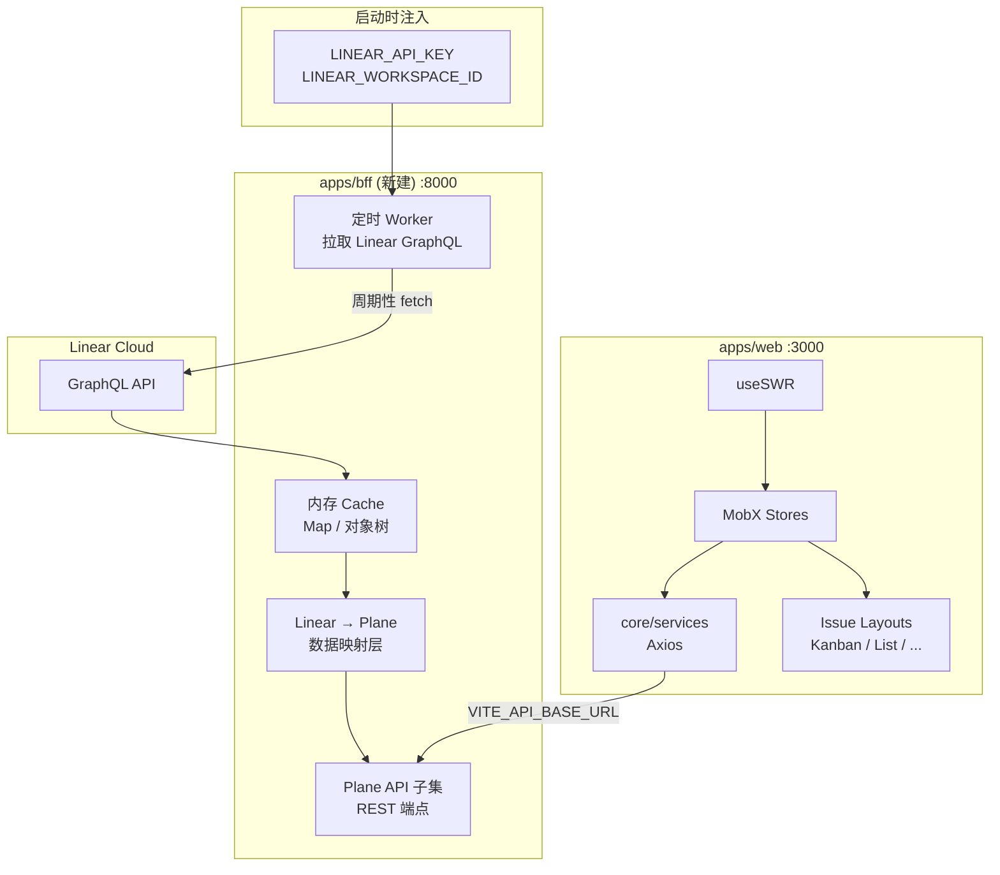
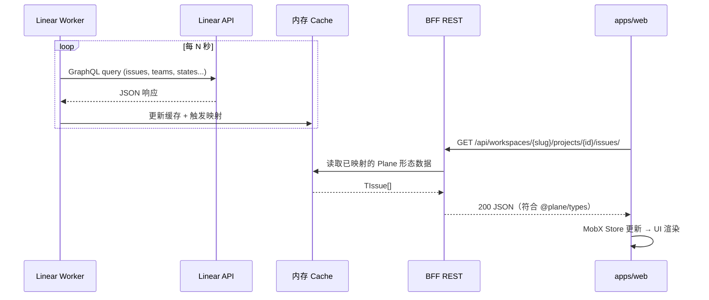

# Plane × Linear 集成项目总览

> **目标**：将 Plane 前端作为 Linear 工单系统的展示层（Display Layer），后端数据来自 Linear API 的内存缓存，不依赖 Plane 数据库（Postgres）持久化。

---

## 1. 项目扫描总结

### 1.1 仓库结构

| 层级         | 路径          | 说明                                                            |
| ------------ | ------------- | --------------------------------------------------------------- |
| Monorepo 根  | `/`           | pnpm + Turbo，Node ≥ 22.18                                      |
| Django API   | `apps/api/`   | **不在** pnpm workspace（`pnpm-workspace.yaml` 中 `!apps/api`） |
| 主前端       | `apps/web/`   | React Router 7，端口 **3000**                                   |
| 管理后台     | `apps/admin/` | 端口 **3001**                                                   |
| Space 公开页 | `apps/space/` | 端口 **3002**                                                   |
| 实时协作     | `apps/live/`  | Express + Hocuspocus，端口 **3100**                             |
| 反向代理     | `apps/proxy/` | Caddy 配置（生产部署用，非开发核心）                            |
| 共享包       | `packages/*`  | ui、propel、services、types、shared-state 等                    |

### 1.2 技术栈速览

```
┌─────────────────────────────────────────────────────────────┐
│  前端 (pnpm workspace)                                       │
│  apps/web · apps/admin · apps/space · apps/live             │
│  packages/ui · propel · services · types · shared-state       │
├─────────────────────────────────────────────────────────────┤
│  后端 (Docker 独立)                                          │
│  apps/api (Django DRF) :8000                                │
│  PostgreSQL · Redis · RabbitMQ · MinIO (docker-compose)     │
└─────────────────────────────────────────────────────────────┘
```

### 1.3 与本项目的关系

当前 Plane 是完整的项目管理产品，包含认证、工作区、项目、Issue、Cycle、Module 等全套功能。本集成项目的核心约束：

- **保留**：`apps/web` 的 UI 层（Kanban / List / Calendar / Gantt 等）
- **替换**：Django API 的数据来源 → 新建 `apps/bff` 从 Linear 拉取并缓存

  > **关于 BFF**：BFF（Backend For Frontend）不是微服务架构里的独立微服务，而是**专为 `apps/web` 适配的后端聚合层**。它位于本 monorepo 的 `apps/bff`，职责是把 Linear GraphQL 数据映射为 Plane 前端期望的 REST 响应，从而在本地开发中**替代 Django API 的数据来源**。单机场景无需拆分微服务。

  > **关于 MobX**：MobX 是 Plane 前端使用的响应式状态管理库。数据流为 `Service (Axios) → MobX Store → UI 组件 (observer)`。Linear 集成**无需改动 MobX 层**，只要 BFF 返回的 JSON 符合 `packages/types` 即可。详见 [01-ui-modules.md §2](./01-ui-modules.md#2-数据流架构)。

- **绕过**：Postgres、Django ORM、用户注册/登录流程

  **Phase 0 认证策略（已确认）**：
  1. **BFF 侧**：Mock Auth 层，所有 bootstrap 端点始终返回 200 + 固定用户（见 [04-implementation-phases.md §2.3](./04-implementation-phases.md#23-mock-数据要求)）。
  2. **前端侧**：Linear 模式下跳过真实登录校验——在路由/layout 层绕过登录重定向（401 拦截器不触发），并在相关 auth 代码处标注 `TODO(auth): Phase 4 前使用 Mock；日后接入 OAuth/Session 等真实认证`。
  3. **不删除**现有 auth 代码，仅条件分支或 env 开关（如 `VITE_LINEAR_DISPLAY_MODE`）控制，便于日后恢复。

- **不启动**：`docker-compose-local.yml` 中的 `api`、数据库等服务（可选）

---

## 2. 目标架构



### 2.1 数据流（目标态）



---

## 3. 构建与启动

### 3.1 标准 Plane 本地开发（参考）

```bash
# 1. 生成各 app 的 .env
./setup.sh

# 2. 启动基础设施 + Django API（Postgres、Redis、RabbitMQ、MinIO、api:8000）
docker compose -f docker-compose-local.yml up

# 3. 启动前端（web:3000, admin:3001, space:3002, live:3100）
pnpm dev
```

关键文件：

| 文件                       | 作用                                                  |
| -------------------------- | ----------------------------------------------------- |
| `setup.sh`                 | 从 `.env.example` 复制各 app 的 `.env`                |
| `docker-compose-local.yml` | 本地 Docker 栈，`api` 服务映射 `8000:8000`            |
| `package.json`             | 根脚本：`pnpm dev` → `turbo run dev --concurrency=18` |
| `pnpm-workspace.yaml`      | workspace 包列表，排除 `apps/api`                     |
| `turbo.json`               | 全局 env 含 `VITE_API_BASE_URL`                       |

### 3.2 Linear 集成模式启动（目标）

```bash
# 1. 配置 BFF 环境变量
export LINEAR_API_KEY="lin_api_..."
export LINEAR_WORKSPACE_ID="your-workspace-id"
export BFF_PORT=8000
export CACHE_POLL_INTERVAL_MS=60000

# 2. 启动 BFF（新建 apps/bff）
pnpm --filter=bff dev

# 3. 配置前端指向 BFF
# apps/web/.env
VITE_API_BASE_URL=http://localhost:8000

# 4. 仅启动 web（不需要 Docker / Django）
pnpm --filter=web dev
```

> **注意**：`packages/constants/src/endpoints.ts` 中 `API_BASE_URL` 读取 `process.env.VITE_API_BASE_URL`，构建时注入，修改 `.env` 后需重启 dev server。

### 3.3 端口一览

| 服务            | 端口 | 配置文件                                                 |
| --------------- | ---- | -------------------------------------------------------- |
| web             | 3000 | `apps/web/package.json` → `react-router dev --port 3000` |
| admin           | 3001 | `apps/admin/package.json`                                |
| space           | 3002 | `apps/space/package.json`                                |
| live            | 3100 | `apps/live/.env.example` → `PORT=3100`                   |
| Django API      | 8000 | `docker-compose-local.yml`                               |
| **BFF（新建）** | 8000 | 与 Django 互斥，二选一                                   |

### 3.4 常用命令

```bash
pnpm build          # 构建所有 workspace 包
pnpm check          # format + lint + types
pnpm check:types    # 仅 TypeScript
pnpm fix            # 自动修复格式和 lint
pnpm turbo run dev --filter=web   # 仅启动 web
```

---

## 4. 关键路径索引

### 4.1 前端 API 注入点

| 文件                                    | 说明                                        |
| --------------------------------------- | ------------------------------------------- |
| `packages/constants/src/endpoints.ts`   | `API_BASE_URL` 常量定义                     |
| `packages/services/src/api.service.ts`  | 共享 Axios 基类（`withCredentials: true`）  |
| `apps/web/core/services/api.service.ts` | Web 专用 Axios 基类（含 401 拦截器）        |
| `apps/web/.env.example`                 | `VITE_API_BASE_URL="http://localhost:8000"` |

### 4.2 核心 Service 层（BFF 需实现的端点来源）

| Service 文件                                              | 主要端点前缀                                     |
| --------------------------------------------------------- | ------------------------------------------------ |
| `apps/web/core/services/user.service.ts`                  | `/api/users/me/*`                                |
| `apps/web/core/services/instance.service.ts`              | `/api/instances/`, `/auth/get-csrf-token/`       |
| `apps/web/core/services/workspace.service.ts`             | `/api/workspaces/*`, `/api/users/me/workspaces/` |
| `apps/web/core/services/project/project.service.ts`       | `/api/workspaces/{slug}/projects/*`              |
| `apps/web/core/services/issue/issue.service.ts`           | `/api/workspaces/{slug}/projects/{id}/issues/*`  |
| `apps/web/core/services/project/project-state.service.ts` | states 相关                                      |
| `apps/web/core/store/label.store.ts` → Label Service      | labels 相关                                      |

### 4.3 类型契约（BFF 响应必须对齐）

| 文件                                     | 核心类型                                         |
| ---------------------------------------- | ------------------------------------------------ |
| `packages/types/src/workspace.ts`        | `IWorkspace`, `IWorkspaceLite`                   |
| `packages/types/src/project/projects.ts` | `TProject`, `TPartialProject`                    |
| `packages/types/src/issues/issue.ts`     | `TIssue`, `TIssuesResponse`, `EIssueLayoutTypes` |
| `packages/types/src/state.ts`            | `IState`, `TStateGroups`                         |
| `packages/types/src/issues.ts`           | `IIssueLabel` 等                                 |

### 4.4 Django 后端（参考，本方案不修改）

| 文件                                   | 说明                                    |
| -------------------------------------- | --------------------------------------- |
| `apps/api/plane/urls.py`               | 顶层路由：`/api/`, `/api/v1/`, `/auth/` |
| `apps/api/plane/app/urls/__init__.py`  | 聚合所有 app 子路由                     |
| `apps/api/plane/app/urls/workspace.py` | 工作区 CRUD                             |
| `apps/api/plane/app/urls/issue.py`     | Issue / Label 端点                      |
| `apps/api/plane/app/urls/project.py`   | 项目端点                                |
| `apps/api/plane/app/urls/state.py`     | 状态端点                                |
| `apps/api/plane/app/views/`            | View 直接操作 ORM（无 Repository 层）   |

### 4.5 UI 渲染入口

| 路径                                             | 说明                                       |
| ------------------------------------------------ | ------------------------------------------ |
| `apps/web/app/routes/core.ts`                    | 主路由定义（workspace → project → issues） |
| `apps/web/app/routes/extended.ts`                | 扩展路由（当前为空数组，可挂载自定义页面） |
| `apps/web/core/store/root.store.ts`              | MobX 根 Store（~25 个子 store）            |
| `apps/web/core/components/issues/issue-layouts/` | Kanban、List、Calendar、Gantt、Spreadsheet |

---

## 5. 方案文档索引

| 文档                                                         | 内容                                          |
| ------------------------------------------------------------ | --------------------------------------------- |
| [01-ui-modules.md](./01-ui-modules.md)                       | UI 三层栈、MobX、功能模块、扩展策略           |
| [02-api-layer.md](./02-api-layer.md)                         | Django 路由、Service 层、认证机制             |
| [03-linear-integration.md](./03-linear-integration.md)       | **核心方案**：BFF 设计、Linear 映射、方案对比 |
| [04-implementation-phases.md](./04-implementation-phases.md) | 分阶段实施、风险、验证清单                    |

---

## 6. 设计原则

1. **最小侵入**：优先新建 `apps/bff`，不改 Django 源码
2. **类型对齐**：BFF 响应严格符合 `packages/types`，前端 Store/Service 零改动或极少改动
3. **只读优先**：Phase 0–3 仅实现 GET 端点；写操作在 Phase 4 扩展（见 [04-implementation-phases.md](./04-implementation-phases.md)）
4. **无持久化**：内存缓存，进程重启后重新拉取 Linear
5. **单工作区**：`LINEAR_WORKSPACE_ID` 映射为 Plane 的单一 workspace

---

## 已解决的开放问题

| 来源                                                                        | 原问题                              | 决议                                                                                                                                             |
| --------------------------------------------------------------------------- | ----------------------------------- | ------------------------------------------------------------------------------------------------------------------------------------------------ |
| §1.3                                                                        | 为什么用 BFF？MobX 是什么？         | BFF 是专为 `apps/web` 适配的数据聚合层（`apps/bff`），非微服务拆分；MobX 是前端状态管理，Linear 集成只需 BFF 对齐 `@plane/types`，无需改 Store。 |
| §1.3                                                                        | 登录逻辑能否暂时注释？              | Phase 0 采用 BFF Mock Auth + 前端路由 bypass，保留原 auth 代码并加 `TODO(auth)`，Phase 4 前不接入真实认证。                                      |
| [03-linear-integration.md §2.1](./03-linear-integration.md#21-方案对比总表) | 确认 Node BFF，不引入 JS 生态外技术 | 方案 A 已锁定：BFF 仅用 Node/TypeScript（Hono、`@plane/types`、`@linear/sdk`），不改造 Django、不引入 Python 侧新依赖。                          |
