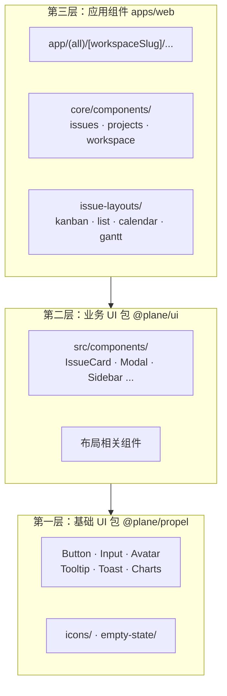
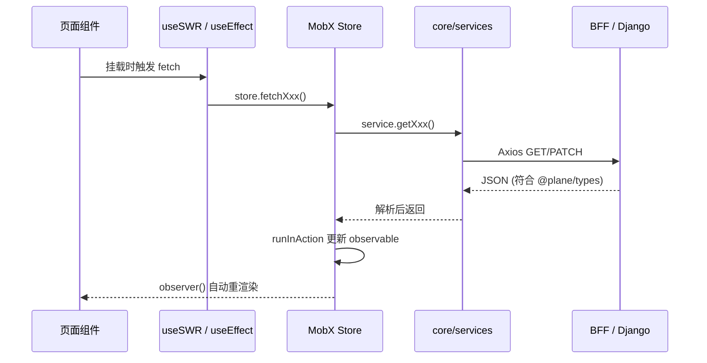
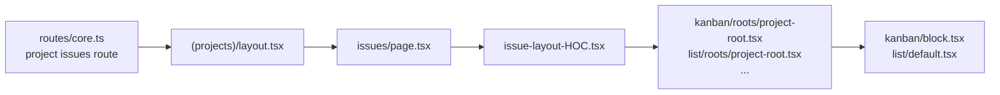
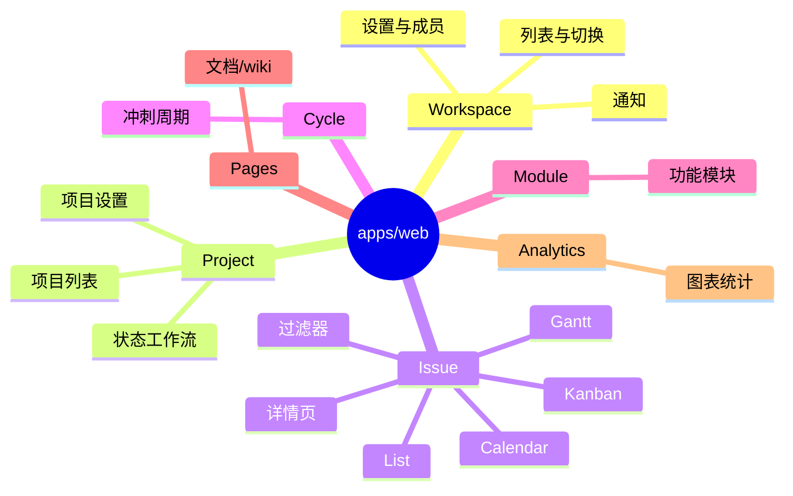
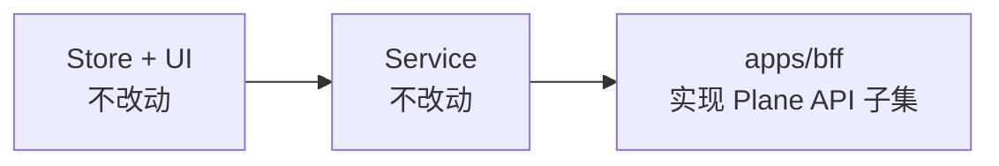

# UI 模块与扩展点

> 本文档描述 Plane 前端 UI 架构，以及在不改动 Store/UI 的前提下对接 Linear BFF 的扩展策略。

---

## 1. UI 三层栈



### 1.1 各层职责

| 层级 | 包/路径                     | 职责                                 | Storybook                                   |
| ---- | --------------------------- | ------------------------------------ | ------------------------------------------- |
| L1   | `packages/propel/`          | 原子级 UI 原语、图标、图表           | `packages/propel/.storybook/`               |
| L2   | `packages/ui/`              | 业务感知组件（Issue 卡片、过滤器等） | `pnpm --filter=@plane/ui storybook` (:6006) |
| L3   | `apps/web/core/components/` | 页面级组合、布局根组件、Store 绑定   | 无独立 Storybook                            |

### 1.2 依赖方向

```
apps/web  →  @plane/ui  →  @plane/propel
           →  @plane/types
           →  @plane/constants
           →  @plane/utils
           →  @plane/shared-state
```

**规则**：下层不可引用上层；`@plane/ui` 不直接依赖 `apps/web`。

---

## 2. 数据流架构



### 2.1 关键文件

| 环节            | 路径                                      | 说明                                         |
| --------------- | ----------------------------------------- | -------------------------------------------- |
| Store 根        | `apps/web/core/store/root.store.ts`       | `CoreRootStore`，聚合 ~25 子 store           |
| Issue Store     | `apps/web/core/store/issue/root.store.ts` | Issue 模块根，含 list/detail/filter 子 store |
| Workspace Store | `apps/web/core/store/workspace/index.ts`  | 工作区 CRUD、导航偏好                        |
| Project Store   | `apps/web/core/store/project/`            | 项目列表与详情                               |
| State Store     | `apps/web/core/store/state.store.ts`      | 工作流状态（Kanban 列）                      |
| Label Store     | `apps/web/core/store/label.store.ts`      | 标签                                         |
| Service 基类    | `apps/web/core/services/api.service.ts`   | Axios + 401 重定向                           |
| 共享 Service    | `packages/services/src/`                  | admin/space 等复用的 service                 |

### 2.2 MobX RootStore 子 Store 清单

`apps/web/core/store/root.store.ts` 中 `CoreRootStore` 包含：

| 属性            | Store 类                   | 文件                    | Linear 集成相关度              |
| --------------- | -------------------------- | ----------------------- | ------------------------------ |
| `workspaceRoot` | `WorkspaceRootStore`       | `workspace/index.ts`    | **高** — 需 Mock 单工作区      |
| `projectRoot`   | `ProjectRootStore`         | `project/`              | **高** — Linear Team → Project |
| `issue`         | `IssueRootStore`           | `issue/root.store.ts`   | **高** — 核心展示              |
| `state`         | `StateStore`               | `state.store.ts`        | **高** — Linear Workflow State |
| `label`         | `LabelStore`               | `label.store.ts`        | **中** — Linear Label          |
| `memberRoot`    | `MemberRootStore`          | `member/`               | **中** — Linear User           |
| `user`          | `UserStore`                | `user/`                 | **中** — 可 Mock 固定用户      |
| `instance`      | `InstanceStore`            | `instance.store.ts`     | **高** — 启动时必调            |
| `cycle`         | `CycleStore`               | `cycle.store.ts`        | 低 — Linear Cycle 可后续映射   |
| `module`        | `ModulesStore`             | `module.store.ts`       | 低                             |
| `projectView`   | `ProjectViewStore`         | `project-view.store.ts` | 低                             |
| `dashboard`     | `DashboardStore`           | `dashboard.store.ts`    | 低                             |
| `analytics`     | `AnalyticsStore`           | `analytics.store.ts`    | 低                             |
| 其他            | theme, router, favorite... | 各对应文件              | 低/无关                        |

---

## 3. 路由结构

### 3.1 路由定义

| 文件                              | 作用                                                   |
| --------------------------------- | ------------------------------------------------------ |
| `apps/web/app/routes/core.ts`     | 主路由（~400 行），含 workspace / project / issue 全套 |
| `apps/web/app/routes/extended.ts` | 扩展路由钩子，当前 `extendedRoutes = []`               |
| `apps/web/app/routes/helper.ts`   | 路由辅助函数                                           |
| `apps/web/app/routes/redirects/`  | 旧 URL 重定向                                          |

### 3.2 关键路由模式

```
/                                          → 登录页
/[workspaceSlug]/                          → 工作区首页
/[workspaceSlug]/projects/                 → 项目列表
/[workspaceSlug]/projects/[projectId]/issues/  → Issue 列表（核心页面）
/[workspaceSlug]/projects/[projectId]/issues/[issueId]/  → Issue 详情
/[workspaceSlug]/settings/                 → 工作区设置
```

### 3.3 Issue 页面加载链



核心目录：`apps/web/core/components/issues/issue-layouts/`

| 布局        | 目录           | 根组件示例                           |
| ----------- | -------------- | ------------------------------------ |
| Kanban      | `kanban/`      | `kanban/roots/project-root.tsx`      |
| List        | `list/`        | `list/roots/project-root.tsx`        |
| Calendar    | `calendar/`    | `calendar/roots/project-root.tsx`    |
| Gantt       | `gantt/`       | `gantt/roots/project-root.tsx`       |
| Spreadsheet | `spreadsheet/` | `spreadsheet/roots/project-root.tsx` |

布局切换由 `apps/web/core/components/issues/issue-layouts/filters/header/layout-selection.tsx` 控制，布局类型枚举见 `packages/types/src/issues/issue.ts` → `EIssueLayoutTypes`。

---

## 4. Service 层与 BFF 对接

### 4.1 Service 分布

```
packages/services/src/          # 跨 app 共享（workspace、auth、cycle 等）
apps/web/core/services/         # Web 专用（issue、project、dashboard 等）
  ├── api.service.ts            # Axios 基类
  ├── user.service.ts
  ├── workspace.service.ts
  ├── instance.service.ts
  ├── auth.service.ts
  ├── project/
  │   ├── project.service.ts
  │   └── project-state.service.ts
  └── issue/
      ├── issue.service.ts      # 核心：CRUD + 列表查询
      └── issue_label.service.ts
```

### 4.2 Issue Service 端点模式

`apps/web/core/services/issue/issue.service.ts` 中的典型调用：

```typescript
// 列表
GET /api/workspaces/{workspaceSlug}/projects/{projectId}/issues/
GET /api/workspaces/{workspaceSlug}/projects/{projectId}/issues-detail/
GET /api/workspaces/{workspaceSlug}/projects/{projectId}/v2/issues/

// 单条
GET /api/workspaces/{workspaceSlug}/projects/{projectId}/issues/{issueId}/

// 写操作（Phase 4 实现，Phase 0–3 只读）
POST /api/workspaces/{workspaceSlug}/projects/{projectId}/issues/
PATCH /api/workspaces/{workspaceSlug}/projects/{projectId}/issues/{issueId}/
```

**扩展策略**：若 BFF 返回的 JSON 结构与 `packages/types` 完全一致，则 **无需修改 Service 和 Store**，仅改 `VITE_API_BASE_URL`。

### 4.3 启动时必调的 API（Bootstrap）

应用加载时会依次请求以下端点（见 `apps/web/app/(all)/layout.preload.tsx` 注释及 layout 逻辑）：

| 端点                            | Service                                | 说明                       |
| ------------------------------- | -------------------------------------- | -------------------------- |
| `GET /api/instances/`           | `InstanceService.getInstanceInfo()`    | 实例元信息，**必须 Mock**  |
| `GET /auth/get-csrf-token/`     | `InstanceService.requestCSRFToken()`   | CSRF，BFF 可返回固定 token |
| `GET /api/users/me/`            | `UserService.currentUser()`            | 当前用户                   |
| `GET /api/users/me/profile/`    | `UserService.getCurrentUserProfile()`  | 用户资料                   |
| `GET /api/users/me/settings/`   | `UserService.getCurrentUserSettings()` | 用户设置                   |
| `GET /api/users/me/workspaces/` | `WorkspaceService.userWorkspaces()`    | 工作区列表                 |

> BFF Phase 0 必须实现上述 bootstrap 端点的 Mock 响应，否则前端无法进入主界面。

---

## 5. 功能模块地图



### 5.1 Linear 集成 MVP 范围

| 模块            | MVP       | 说明                                                                         |
| --------------- | --------- | ---------------------------------------------------------------------------- |
| Workspace       | ✅ Mock   | 单一 workspace，slug 可配置                                                  |
| Project         | ✅        | Linear Team → Plane Project                                                  |
| Issue 列表/详情 | ✅        | Linear Issue → Plane TIssue                                                  |
| State           | ✅        | Linear Workflow State → IState                                               |
| Label           | ✅        | Linear Label → IIssueLabel                                                   |
| User/Member     | ⚠️ Mock   | 固定用户或 Linear User 映射                                                  |
| Auth            | ⚠️ Bypass | Phase 0：BFF Mock + 前端 bypass；`TODO(auth)` 标记，Phase 4 前不接入真实认证 |
| Cycle/Module    | ❌        | 后续阶段                                                                     |
| Pages/Analytics | ❌        | 非核心                                                                       |
| Live 协作       | ❌        | 需要 Django + Redis，本方案不涉及                                            |

---

## 6. 扩展点与改造策略

### 6.1 推荐：零改动 UI（BFF 适配）



**条件**：BFF 响应 JSON 字段名、类型、嵌套结构与 Django 序列化器输出一致。

### 6.2 备选：Service 层适配

若 Linear 数据结构差异较大，可在 `apps/web/core/services/` 新增薄适配层：

```
apps/web/core/services/
  └── linear-adapter/          # 新建
      ├── workspace.adapter.ts # 转换 BFF 响应 → IWorkspace
      └── issue.adapter.ts     # 转换 → TIssue
```

Store 调用 adapter 而非直接解析 API 响应。此方案改动面大于 BFF 映射，仅在 BFF 无法完全对齐时使用。

### 6.3 扩展路由

`apps/web/app/routes/extended.ts` 当前为空：

```typescript
export const extendedRoutes: RouteConfigEntry[] = [];
```

可用于挂载 Linear 特有的调试页面（如同步状态、缓存刷新按钮），不影响核心 Issue 流程。

### 6.4 环境变量扩展

| 变量                       | 位置            | 用途                                       |
| -------------------------- | --------------- | ------------------------------------------ |
| `VITE_API_BASE_URL`        | `apps/web/.env` | 指向 BFF                                   |
| `VITE_LINEAR_DISPLAY_MODE` | 可选新增        | 标识 Linear 模式，用于 UI 隐藏不支持的功能 |

若需按模式隐藏 UI 元素（如 Cycle、Module 入口），可在组件中读取该变量，或利用 `instance` store 的自定义字段。

---

## 7. 与 @plane/shared-state 的关系

`packages/shared-state/` 提供跨组件的过滤器状态（`WorkItemFilterStore`），在 `root.store.ts` 中实例化：

```typescript
this.workItemFilters = new WorkItemFilterStore();
```

Issue 列表的过滤、排序、分组逻辑依赖此 store + `packages/types/src/rich-filters/`。BFF 需支持 Issue 列表的 query 参数（`state`, `priority`, `labels`, `assignees`, `group_by`, `order_by` 等），至少实现前端默认发送的参数子集。

---

## 8. 关键类型参考

对接 BFF 时须对齐的核心类型（定义于 `packages/types/src/`）：

### TIssue（`issues/issue.ts`）

```typescript
type TBaseIssue = {
  id: string;
  sequence_id: number;
  name: string;
  sort_order: number;
  state_id: string | null;
  priority: TIssuePriorities | null;
  label_ids: string[];
  assignee_ids: string[];
  // ...
};
```

### IState（`state.ts`）

```typescript
interface IState {
  id: string;
  name: string;
  color: string;
  group: TStateGroups; // "backlog" | "unstarted" | "started" | "completed" | "cancelled"
  project_id: string;
  sequence: number;
  // ...
}
```

### IWorkspace（`workspace.ts`）

```typescript
interface IWorkspace {
  id: string;
  name: string;
  slug: string;
  logo_url: string | null;
  role: number;
  // ...
}
```

完整字段清单以实现阶段从 Django serializer 或 `packages/types` 反查为准。
