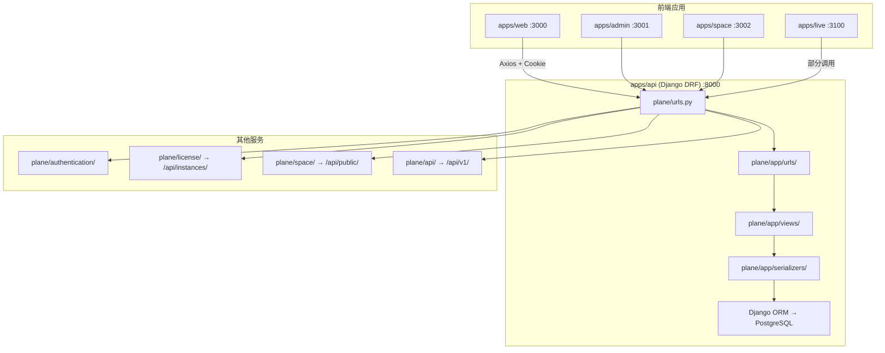
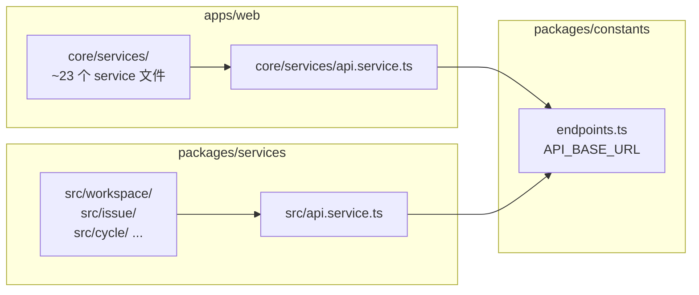
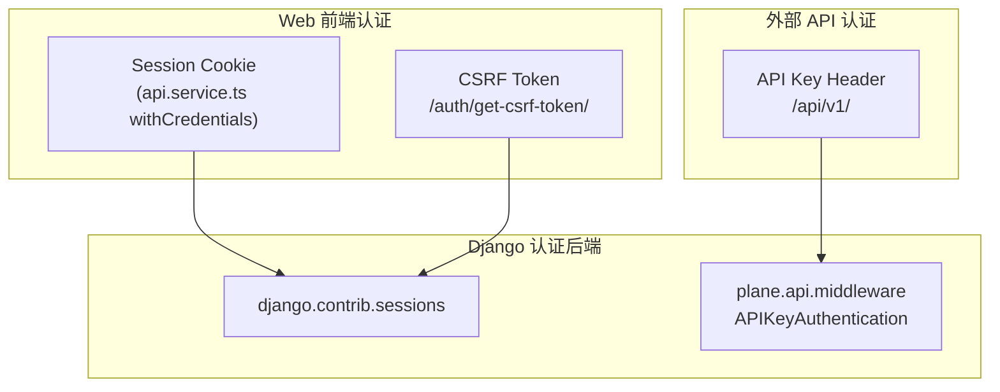

# API 层架构与修改点

> 本文档描述 Plane 现有 API 架构（Django DRF），以及 Linear 集成场景下的改造/绕过策略。

---

## 1. API 架构总览



### 1.1 技术特征

| 特征     | 说明                                                     |
| -------- | -------------------------------------------------------- |
| 框架     | Django 4.x + Django REST Framework                       |
| 数据访问 | View 直接操作 ORM，**无 Repository 层**                  |
| 部署     | Docker（`apps/api/Dockerfile.api`），不在 pnpm workspace |
| 端口     | 8000（`docker-compose-local.yml`）                       |
| 协作服务 | `apps/live` 独立 Express 服务，非 CRUD                   |

---

## 2. 路由结构

### 2.1 顶层路由

文件：`apps/api/plane/urls.py`

```python
urlpatterns = [
    path("api/",           include("plane.app.urls")),       # 主 Web API
    path("api/public/",    include("plane.space.urls")),     # Space 公开 API
    path("api/instances/", include("plane.license.urls")),   # 实例/许可证
    path("api/v1/",        include("plane.api.urls")),       # 外部 API（API Key 认证）
    path("auth/",          include("plane.authentication.urls")),
    path("",               include("plane.web.urls")),       # health check
]
```

### 2.2 主 API 子路由聚合

文件：`apps/api/plane/app/urls/__init__.py`

| 子模块文件        | 资源                               |
| ----------------- | ---------------------------------- |
| `workspace.py`    | 工作区 CRUD、成员、邀请、导航偏好  |
| `project.py`      | 项目 CRUD、成员、标识符            |
| `issue.py`        | Issue CRUD、标签、评论、附件、关联 |
| `state.py`        | 工作流状态                         |
| `cycle.py`        | 周期/冲刺                          |
| `module.py`       | 功能模块                           |
| `user.py`         | 用户资料、设置                     |
| `page.py`         | Wiki 页面                          |
| `notification.py` | 通知                               |
| `analytic.py`     | 分析统计                           |
| `asset.py`        | 文件/附件                          |
| `search.py`       | 搜索                               |
| `webhook.py`      | Webhook                            |
| `intake.py`       | Intake 表单                        |
| `estimate.py`     | 估算点                             |
| `views.py`        | 自定义视图                         |
| `api.py`          | API Token 管理                     |
| `external.py`     | 外部集成                           |
| `timezone.py`     | 时区                               |
| `exporter.py`     | 数据导出                           |

### 2.3 Linear 集成相关端点（BFF 需实现子集）

#### Workspace

文件：`apps/api/plane/app/urls/workspace.py`

```
GET  /api/users/me/workspaces/                    → 用户工作区列表
GET  /api/workspaces/{slug}/                      → 工作区详情
POST /api/workspaces/                             → 创建工作区
GET  /api/workspaces/{slug}/states/               → 工作区级状态
GET  /api/workspaces/{slug}/labels/               → 工作区级标签
```

#### Project

文件：`apps/api/plane/app/urls/project.py`

```
GET  /api/workspaces/{slug}/projects/             → 项目列表（lite）
GET  /api/workspaces/{slug}/projects/details/     → 项目列表（完整）
GET  /api/workspaces/{slug}/projects/{id}/        → 项目详情
POST /api/workspaces/{slug}/projects/             → 创建项目
```

#### Issue

文件：`apps/api/plane/app/urls/issue.py`

```
GET  /api/workspaces/{slug}/projects/{id}/issues/          → Issue 列表
GET  /api/workspaces/{slug}/projects/{id}/issues-detail/   → Issue 列表（含关联）
GET  /api/workspaces/{slug}/projects/{id}/v2/issues/       → 分页 Issue 列表
GET  /api/workspaces/{slug}/projects/{id}/issues/{pk}/     → Issue 详情
POST /api/workspaces/{slug}/projects/{id}/issues/          → 创建 Issue
PATCH /api/workspaces/{slug}/projects/{id}/issues/{pk}/    → 更新 Issue
GET  /api/workspaces/{slug}/projects/{id}/issue-labels/    → 标签列表
```

#### State

文件：`apps/api/plane/app/urls/state.py`

```
GET  /api/workspaces/{slug}/projects/{id}/states/          → 项目状态列表
POST /api/workspaces/{slug}/projects/{id}/states/          → 创建状态
```

#### User / Instance / Auth

```
GET  /api/users/me/                                 → 当前用户
GET  /api/users/me/profile/                         → 用户资料
GET  /api/users/me/settings/                        → 用户设置
GET  /api/instances/                                → 实例信息
GET  /auth/get-csrf-token/                          → CSRF Token
```

---

## 3. 前端 Service 层

### 3.1 双层 Service 架构



### 3.2 Axios 配置

**共享基类** — `packages/services/src/api.service.ts`：

```typescript
constructor(baseURL: string) {
  this.axiosInstance = create({
    baseURL,
    withCredentials: true,  // 发送 session cookie
  });
}
```

**Web 专用基类** — `apps/web/core/services/api.service.ts`：

- 额外配置 401 响应拦截器，重定向到登录页
- Linear 模式下 BFF 应始终返回 200（Mock 认证），避免触发 401 跳转

### 3.3 API_BASE_URL 注入链

```
apps/web/.env
  VITE_API_BASE_URL=http://localhost:8000
    ↓ 构建时注入
packages/constants/src/endpoints.ts
  export const API_BASE_URL = process.env.VITE_API_BASE_URL || "";
    ↓ import
apps/web/core/services/*.ts
  super(API_BASE_URL);
```

**修改点**：仅需将 `VITE_API_BASE_URL` 指向 BFF 地址，无需改代码。

### 3.4 核心 Service 文件清单

#### apps/web/core/services/（Web 专用）

| 文件                               | 端点前缀                            | Linear 相关度 |
| ---------------------------------- | ----------------------------------- | ------------- |
| `user.service.ts`                  | `/api/users/me/*`                   | 高（Mock）    |
| `instance.service.ts`              | `/api/instances/`, `/auth/*`        | 高（Mock）    |
| `auth.service.ts`                  | `/auth/*`                           | 高（Bypass）  |
| `workspace.service.ts`             | `/api/workspaces/*`                 | 高            |
| `project/project.service.ts`       | `/api/workspaces/{slug}/projects/*` | 高            |
| `project/project-state.service.ts` | states                              | 高            |
| `issue/issue.service.ts`           | issues                              | **最高**      |
| `issue/issue_label.service.ts`     | labels                              | 高            |
| `cycle.service.ts`                 | cycles                              | 低            |
| `module.service.ts`                | modules                             | 低            |
| `dashboard.service.ts`             | dashboard                           | 低            |
| `analytics.service.ts`             | analytics                           | 低            |

#### packages/services/src/（跨 app 共享）

| 目录              | 说明                                               |
| ----------------- | -------------------------------------------------- |
| `workspace/`      | WorkspaceService, MemberService, InvitationService |
| `auth/`           | AuthService, SitesAuthService                      |
| `instance/`       | InstanceService                                    |
| `user/`           | UserService, FavoriteService                       |
| `cycle/`          | CycleService, CycleOperationsService               |
| `module/`         | ModuleService                                      |
| `issue/`          | SitesIssueService（Space 用）                      |
| `state/`          | SitesStateService                                  |
| `label/`          | SitesLabelService                                  |
| `file/`           | FileService, FileUploadService                     |
| `live.service.ts` | Live 协作服务连接                                  |

---

## 4. 认证机制

### 4.1 现有认证方式



| 路由前缀          | 认证方式              | 用途           |
| ----------------- | --------------------- | -------------- |
| `/api/`           | Session Cookie + CSRF | Web 前端主 API |
| `/api/v1/`        | API Key (`X-Api-Key`) | 外部集成       |
| `/api/public/`    | 无/公开               | Space 公开页面 |
| `/api/instances/` | 无/公开               | 实例元信息     |
| `/auth/`          | CSRF                  | 登录/注册/登出 |

### 4.2 Linear 模式认证策略

**推荐：Bypass 认证（Phase 0–3；Phase 4 前不接入真实认证）**

BFF 对所有请求返回 Mock 用户数据，不校验 Cookie/Token。前端在 Linear 模式下绕过登录路由/401 重定向，并在 auth 相关代码保留 `TODO(auth): 日后接入真实认证` 标记，**不删除**现有 auth 逻辑：

```typescript
// BFF 伪代码
app.use((req, res, next) => {
  req.user = MOCK_USER; // 固定用户
  next();
});
```

前端侧可选措施：

- BFF 不返回 401，避免 `api.service.ts` 的 401 拦截器触发
- Mock `/api/users/me/` 返回已登录用户
- Mock `/api/instances/` 返回 `is_setup_done: true`

---

## 5. Django 后端修改点（备选方案，不推荐）

若选择改造 Django 而非新建 BFF，需修改以下位置：

### 5.1 新增 Linear 数据源

```
apps/api/plane/
  └── integrations/
      └── linear/
          ├── client.py          # Linear GraphQL 客户端
          ├── cache.py           # 内存缓存
          ├── mapper.py          # Linear → Plane 映射
          ├── worker.py          # 定时拉取任务
          └── views.py           # 替代 ORM 的 View
```

### 5.2 修改 View 层

现有 View 直接查询 ORM，例如 `apps/api/plane/app/views/issue/base.py`：

```python
# 现有模式
issues = Issue.objects.filter(project_id=project_id)

# 需改为
issues = linear_cache.get_issues(project_id)
```

需修改的 View 目录：`apps/api/plane/app/views/`（约 50+ 文件）

### 5.3 环境变量注入

```
apps/api/.env
  LINEAR_API_KEY=lin_api_...
  LINEAR_WORKSPACE_ID=...
  USE_LINEAR_CACHE=true
```

### 5.4 为何不推荐

| 问题          | 说明                                      |
| ------------- | ----------------------------------------- |
| 改动面大      | 50+ View 文件需逐一改造                   |
| 仍需 Docker   | Postgres/Redis 等依赖仍须启动（即使不用） |
| Django 启动慢 | 对比 Node BFF 冷启动                      |
| 升级冲突      | 与上游 Plane 合并困难                     |
| 测试负担      | 需维护 Django pytest 套件                 |

---

## 6. apps/live 服务

### 6.1 定位

| 属性 | 值                               |
| ---- | -------------------------------- |
| 路径 | `apps/live/`                     |
| 技术 | Express + Hocuspocus (Yjs CRDT)  |
| 端口 | 3100（`apps/live/.env.example`） |
| 用途 | 富文本编辑器实时协作、PDF 导出   |
| 数据 | 依赖 Django API + Redis          |

### 6.2 与 Linear 集成的关系

**本方案不涉及 `apps/live`**。Issue 描述展示可用只读 HTML/Markdown 渲染，不需要实时协作编辑。若后续需要编辑 Issue 描述并回写 Linear，可单独评估。

---

## 7. apps/proxy 服务

### 7.1 定位

| 文件                          | 说明                           |
| ----------------------------- | ------------------------------ |
| `apps/proxy/Caddyfile.ce`     | Community Edition 反向代理配置 |
| `apps/proxy/Caddyfile.aio.ce` | All-in-One 部署配置            |
| `apps/proxy/Dockerfile.ce`    | 生产 Docker 镜像               |

用于生产环境将 web/admin/api/live 统一到一个域名下。Linear 集成模式下，proxy 配置需将 `/api/*` 路由到 BFF 而非 Django。

---

## 8. 三种方案对比

| 维度         | A. Node BFF（推荐）    | B. Django 改造      | C. Proxy 转发          |
| ------------ | ---------------------- | ------------------- | ---------------------- |
| 新建代码     | `apps/bff/`            | 修改 `apps/api/`    | `apps/proxy/` 或 nginx |
| Django 依赖  | 不需要                 | 需要（即使不用 DB） | 不需要                 |
| Docker 依赖  | 不需要                 | 需要                | 不需要                 |
| 前端改动     | 仅 `VITE_API_BASE_URL` | 仅 env              | 仅 proxy 配置          |
| 响应格式控制 | BFF 完全控制           | Serializer 改造     | 需 BFF 或 Django       |
| 升级维护     | 独立服务，隔离         | 与上游冲突大        | 中等                   |
| 开发体验     | 热重载快               | Docker 重建慢       | 取决于后端             |
| 适合场景     | **只读展示**           | 需完整 Plane API    | 生产统一部署           |

**结论**：方案 A（Node BFF）最适合「Plane 作 Linear 展示层、无持久化」的目标。详见 [03-linear-integration.md](./03-linear-integration.md)。

---

## 9. BFF 最小端点清单（Phase 0 Bootstrap）

以下端点是前端启动的硬性依赖，BFF 必须实现：

| #   | 方法 | 端点                                                 | 响应类型                 |
| --- | ---- | ---------------------------------------------------- | ------------------------ |
| 1   | GET  | `/api/instances/`                                    | `IInstanceInfo`          |
| 2   | GET  | `/auth/get-csrf-token/`                              | `{ csrf_token: string }` |
| 3   | GET  | `/api/users/me/`                                     | `IUser`                  |
| 4   | GET  | `/api/users/me/profile/`                             | Profile 对象             |
| 5   | GET  | `/api/users/me/settings/`                            | Settings 对象            |
| 6   | GET  | `/api/users/me/workspaces/`                          | `IWorkspace[]`           |
| 7   | GET  | `/api/workspaces/{slug}/`                            | `IWorkspace`             |
| 8   | GET  | `/api/workspaces/{slug}/projects/`                   | `TPartialProject[]`      |
| 9   | GET  | `/api/workspaces/{slug}/projects/details/`           | `TProject[]`             |
| 10  | GET  | `/api/workspaces/{slug}/projects/{id}/`              | `TProject`               |
| 11  | GET  | `/api/workspaces/{slug}/projects/{id}/states/`       | `IState[]`               |
| 12  | GET  | `/api/workspaces/{slug}/projects/{id}/issues/`       | `TIssuesResponse`        |
| 13  | GET  | `/api/workspaces/{slug}/projects/{id}/issues/{pk}/`  | `TIssue`                 |
| 14  | GET  | `/api/workspaces/{slug}/projects/{id}/issue-labels/` | `IIssueLabel[]`          |

类型定义均来自 `packages/types/src/`。

---

## 10. 响应格式参考

BFF 实现时，建议从以下来源获取响应格式：

1. **类型定义**：`packages/types/src/` — TypeScript interface 即契约
2. **Django Serializer**：`apps/api/plane/app/serializers/` — 字段名和嵌套结构
3. **实际响应**：启动 Django 后 curl 抓取（仅作参考）

示例：抓取 Issue 列表响应格式

```bash
# 需先启动 Django 并有测试数据
curl -s http://localhost:8000/api/workspaces/{slug}/projects/{id}/issues/ \
  -H "Cookie: sessionid=..." | jq '.[0] | keys'
```

BFF 开发时可将 Django 响应保存为 fixture，用于对比测试。
