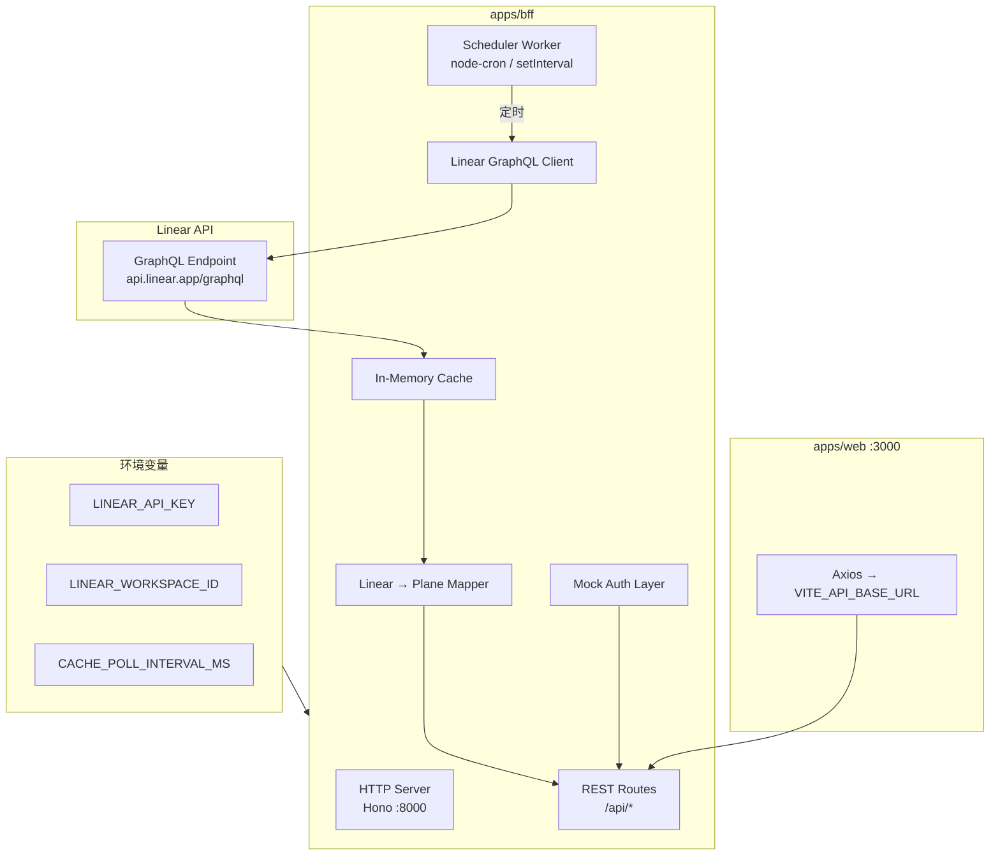
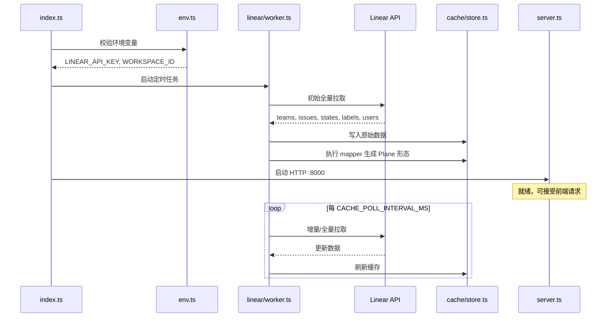
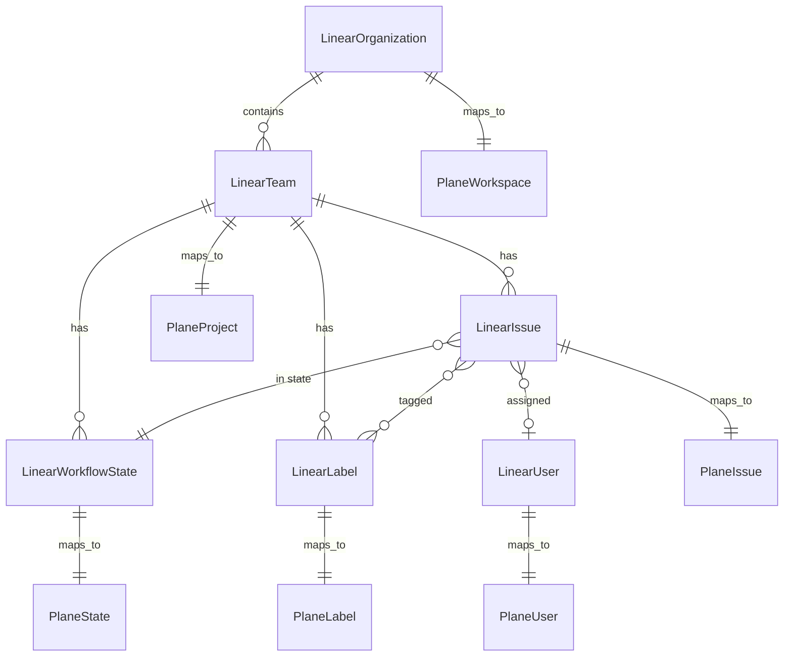

# Linear 集成核心方案

> **推荐方案**：新建 `apps/bff` Node 服务，启动时注入 Linear 凭证，定时拉取 Linear GraphQL API 缓存至内存，对外提供 Plane API 子集端点。

---

## 1. 方案目标

| 目标            | 说明                                                        |
| --------------- | ----------------------------------------------------------- |
| Plane 作展示层  | 复用 `apps/web` 全套 Issue UI（Kanban/List/Calendar/Gantt） |
| Linear 作数据源 | 通过 Linear GraphQL API 获取 Issue/Team/State/Label         |
| 无 Plane 数据库 | 不启动 Postgres，不依赖 Django ORM                          |
| 无持久化        | 内存缓存，进程重启后重新拉取                                |
| 最小前端改动    | 仅修改 `VITE_API_BASE_URL` 指向 BFF                         |

---

## 2. 三种方案 Trade-off 分析

### 2.1 方案对比总表

| 维度                | A. Node BFF ✅ **已确认** | B. Django 改造             | C. Proxy + 外部转换      |
| ------------------- | ------------------------- | -------------------------- | ------------------------ |
| **实现位置**        | `apps/bff/`（新建）       | `apps/api/plane/`          | `apps/proxy/` + 外部服务 |
| **技术栈**          | Node/Hono (TypeScript)    | Python/Django DRF          | Caddy/nginx + 任意后端   |
| **Django 依赖**     | ❌ 不需要                 | ✅ 必须启动                | ❌ 不需要                |
| **Docker 依赖**     | ❌ 不需要                 | ✅ Postgres/Redis/RabbitMQ | ❌ 不需要                |
| **前端改动**        | `VITE_API_BASE_URL`       | `VITE_API_BASE_URL`        | Proxy 路由配置           |
| **API 格式控制**    | BFF 完全控制映射          | 改 Serializer/View         | 取决于后端               |
| **Linear 凭证注入** | BFF `.env`                | Django `.env`              | 外部服务 `.env`          |
| **缓存策略**        | 内存 Map                  | 内存/Django cache          | 取决于后端               |
| **开发热重载**      | ⚡ 极快                   | 🐢 Docker 重建             | 中等                     |
| **上游合并冲突**    | 无（独立目录）            | 高（改核心 API）           | 低（仅 proxy 配置）      |
| **写操作支持**      | BFF 转发 Linear mutation  | Django View 改造           | 同 BFF                   |
| **适合场景**        | **只读展示 MVP**          | 需完整 Plane 功能          | 生产统一部署             |

### 2.2 方案 A：Node BFF（推荐）



**优势**：

- 与 Plane 代码库完全解耦，不污染 Django 代码
- 可用 TypeScript，直接 import `@plane/types` 做类型检查
- 纳入 pnpm workspace，`pnpm --filter=bff dev` 一键启动
- 内存缓存 + 定时 worker，架构简单清晰

**劣势**：

- 需自行实现 Plane API 子集（约 14+ 端点）
- 写操作需额外实现 Linear mutation 转发
- 无 Django 的 CSRF/Session 安全机制（只读场景可接受）

### 2.3 方案 B：Django 改造

在 `apps/api/plane/` 内新增 Linear 集成层，View 从内存缓存读取而非 ORM。

**优势**：

- 可复用现有 Serializer 确保响应格式一致
- 保留 Django 认证/权限框架

**劣势**：

- 需修改 50+ View 文件或创建大量 override
- 仍需 Docker 启动 Django + 依赖服务
- 与上游 Plane 版本合并困难
- Python 生态调用 Linear GraphQL 不如 Node/TS 便捷

### 2.4 方案 C：Proxy 转发

通过 `apps/proxy/Caddyfile.ce` 将 `/api/*` 路由到外部转换服务。

**优势**：

- 前端和 BFF 可独立部署
- 生产环境统一域名

**劣势**：

- 仍需一个转换服务（实质上是方案 A 的部署变体）
- 本地开发多一层 proxy 配置
- 不能单独解决问题，必须与 A 或 B 组合

### 2.5 结论

**选择方案 A（Node BFF）**，理由：

1. 目标明确：只读展示，不需要 Django 全套功能
2. 零 Django 依赖，本地开发只需 `pnpm dev`
3. TypeScript 类型与 `@plane/types` 对齐
4. 独立服务，不影响上游 Plane 代码
5. **技术栈约束（已确认）**：BFF 仅使用 Node/TypeScript 生态——HTTP 框架用 **Hono**，Linear 客户端用 **`@linear/sdk`** 或原生 fetch，类型对齐 **`@plane/types`**；**不引入 Python 或其他运行时**，也不改造 Django 源码

---

## 3. BFF 服务设计

### 3.1 目录结构（建议）

```
apps/bff/
├── package.json
├── tsconfig.json
├── .env.example
├── src/
│   ├── index.ts                 # 入口：启动 HTTP + Worker
│   ├── env.ts                   # 环境变量校验（zod）
│   ├── server.ts                # HTTP Server 配置
│   ├── routes/
│   │   ├── index.ts             # 路由聚合
│   │   ├── instance.ts          # /api/instances/
│   │   ├── auth.ts              # /auth/*
│   │   ├── user.ts              # /api/users/me/*
│   │   ├── workspace.ts         # /api/workspaces/*
│   │   ├── project.ts           # projects
│   │   ├── issue.ts             # issues
│   │   ├── state.ts             # states
│   │   └── label.ts             # labels
│   ├── linear/
│   │   ├── client.ts            # GraphQL 客户端
│   │   ├── queries.ts           # GraphQL 查询定义
│   │   ├── types.ts             # Linear 原始类型
│   │   └── worker.ts            # 定时拉取调度器
│   ├── cache/
│   │   ├── store.ts             # 内存缓存（Map 结构）
│   │   └── keys.ts              # 缓存键常量
│   ├── mapper/
│   │   ├── workspace.ts         # Linear Organization → IWorkspace
│   │   ├── project.ts           # Linear Team → TProject
│   │   ├── issue.ts             # Linear Issue → TIssue
│   │   ├── state.ts             # Linear WorkflowState → IState
│   │   ├── label.ts             # Linear Label → IIssueLabel
│   │   └── user.ts              # Linear User → IUser
│   └── mock/
│       ├── user.ts              # Mock 当前用户
│       ├── instance.ts          # Mock 实例信息
│       └── auth.ts              # Mock CSRF
└── tests/
    ├── mapper.test.ts
    └── routes.test.ts
```

### 3.2 环境变量

```bash
# apps/bff/.env.example

# Linear 凭证（启动时注入，必填）
LINEAR_API_KEY=lin_api_xxxxxxxxxxxx
LINEAR_WORKSPACE_ID=your-linear-workspace-uuid

# BFF 服务
BFF_PORT=8000
NODE_ENV=development

# 缓存配置
CACHE_POLL_INTERVAL_MS=60000        # 拉取间隔，默认 60s
CACHE_INITIAL_FETCH=true            # 启动时立即拉取

# Plane 映射配置
PLANE_WORKSPACE_SLUG=linear         # 映射后的 workspace slug
PLANE_WORKSPACE_NAME=Linear         # 映射后的 workspace 名称
MOCK_USER_EMAIL=dev@linear.local    # Mock 用户邮箱
MOCK_USER_NAME=Linear Viewer        # Mock 用户显示名

# CORS（开发）
CORS_ORIGIN=http://localhost:3000
```

### 3.3 启动流程



### 3.4 内存缓存结构

```typescript
// cache/store.ts 概念设计
interface CacheStore {
  // Linear 原始数据
  linear: {
    organization: LinearOrganization | null;
    teams: Map<string, LinearTeam>;
    issues: Map<string, LinearIssue>;
    workflowStates: Map<string, LinearWorkflowState>;
    labels: Map<string, LinearLabel>;
    users: Map<string, LinearUser>;
    lastFetchedAt: Date | null;
  };

  // Plane 映射后数据（供 API 直接返回）
  plane: {
    workspace: IWorkspace;
    projects: Map<string, TProject>; // teamId → project
    issues: Map<string, TIssue>; // issueId → issue
    issuesByProject: Map<string, string[]>; // projectId → issueIds
    states: Map<string, IState[]>; // projectId → states
    labels: Map<string, IIssueLabel[]>; // projectId → labels
    users: Map<string, IUserLite>;
  };

  // 索引
  indexes: {
    projectBySlug: Map<string, string>; // projectIdentifier → projectId
    issueByIdentifier: Map<string, string>; // "TEAM-123" → issueId
  };
}
```

---

## 4. Linear GraphQL 查询

### 4.1 核心查询

```graphql
# queries.ts — 全量拉取
query SyncData($workspaceId: String!) {
  organization(id: $workspaceId) {
    id
    name
    urlKey
    teams {
      nodes {
        id
        name
        key
        description
        issues {
          nodes {
            id
            identifier
            title
            description
            priority
            sortOrder
            createdAt
            updatedAt
            dueDate
            estimate
            state {
              id
              name
              color
              type
            }
            assignee {
              id
              name
              email
              displayName
              avatarUrl
            }
            labels {
              nodes {
                id
                name
                color
              }
            }
            project {
              id
              name
            }
            parent {
              id
              identifier
            }
            children {
              nodes {
                id
                identifier
              }
            }
          }
        }
        states {
          nodes {
            id
            name
            color
            type
            position
          }
        }
        labels {
          nodes {
            id
            name
            color
          }
        }
      }
    }
    users {
      nodes {
        id
        name
        email
        displayName
        avatarUrl
        active
      }
    }
  }
}
```

### 4.2 Linear API 客户端

```typescript
// linear/client.ts 概念设计
import { LinearClient } from "@linear/sdk"; // 官方 SDK

export function createLinearClient(apiKey: string) {
  return new LinearClient({ apiKey });
}

// 或使用原生 fetch + GraphQL
export async function graphql<T>(apiKey: string, query: string, variables?: Record<string, unknown>): Promise<T> {
  const response = await fetch("https://api.linear.app/graphql", {
    method: "POST",
    headers: {
      "Content-Type": "application/json",
      Authorization: apiKey,
    },
    body: JSON.stringify({ query, variables }),
  });
  return response.json();
}
```

### 4.3 速率限制

| 限制           | 值                       | 应对                          |
| -------------- | ------------------------ | ----------------------------- |
| API Rate Limit | 1500 req/hour (Personal) | 全量拉取 + 定时增量，避免高频 |
| 分页           | issues 默认 50 条/页     | 使用 cursor pagination        |
| 复杂度         | 查询复杂度限制           | 拆分查询或降低嵌套深度        |

Worker 策略：

1. 启动时全量拉取（可能需分页）
2. 后续定时增量：使用 `updatedAt` 过滤或 Linear webhook（可选）
3. 缓存未就绪时 API 返回 503 + `Retry-After`

---

## 5. Linear → Plane 数据映射

### 5.1 实体映射关系



### 5.2 映射规则详表

#### Organization → Workspace

| Linear 字段 | Plane 字段 (`IWorkspace`) | 规则                               |
| ----------- | ------------------------- | ---------------------------------- |
| `id`        | `id`                      | 直接使用 UUID                      |
| `name`      | `name`                    | 直接映射                           |
| `urlKey`    | `slug`                    | 或使用 `PLANE_WORKSPACE_SLUG` 配置 |
| —           | `logo_url`                | `null`                             |
| —           | `role`                    | 固定 `20`（ADMIN）                 |
| —           | `total_members`           | 从 users 数量计算                  |
| —           | `owner`                   | Mock 用户                          |

#### Team → Project

| Linear 字段           | Plane 字段 (`TProject`) | 规则                  |
| --------------------- | ----------------------- | --------------------- |
| `id`                  | `id`                    | 直接 UUID             |
| `name`                | `name`                  | 直接映射              |
| `key`                 | `identifier`            | 如 "ENG"              |
| `description`         | `description`           | 直接映射              |
| —                     | `workspace`             | 映射后的 workspace ID |
| —                     | `emoji`                 | 默认 📋               |
| `issues.nodes.length` | `total_issues`          | 计数                  |
| —                     | `total_members`         | 从 team members 计算  |

#### Issue → TIssue

| Linear 字段           | Plane 字段         | 规则                                            |
| --------------------- | ------------------ | ----------------------------------------------- |
| `id`                  | `id`               | UUID                                            |
| `identifier` 数字部分 | `sequence_id`      | 如 "ENG-42" → 42                                |
| `title`               | `name`             | 直接映射                                        |
| `sortOrder`           | `sort_order`       | 直接映射                                        |
| `state.id`            | `state_id`         | 映射后的 state ID                               |
| `priority`            | `priority`         | 映射：0→none, 1→urgent, 2→high, 3→medium, 4→low |
| `labels.nodes[].id`   | `label_ids`        | ID 数组                                         |
| `assignee.id`         | `assignee_ids`     | 单元素数组                                      |
| `description`         | `description_html` | Markdown → HTML                                 |
| `dueDate`             | `target_date`      | ISO 日期                                        |
| `estimate`            | `estimate_point`   | 直接映射                                        |
| `createdAt`           | `created_at`       | ISO 时间戳                                      |
| `updatedAt`           | `updated_at`       | ISO 时间戳                                      |
| `parent.id`           | `parent_id`        | 父 Issue ID                                     |
| children count        | `sub_issues_count` | 子 Issue 计数                                   |

#### WorkflowState → IState

| Linear `type` | Plane `group` (`TStateGroups`) |
| ------------- | ------------------------------ |
| `backlog`     | `"backlog"`                    |
| `unstarted`   | `"unstarted"`                  |
| `started`     | `"started"`                    |
| `completed`   | `"completed"`                  |
| `cancelled`   | `"cancelled"`                  |

| Linear 字段 | Plane 字段   | 规则         |
| ----------- | ------------ | ------------ |
| `id`        | `id`         | UUID         |
| `name`      | `name`       | 直接映射     |
| `color`     | `color`      | 直接映射     |
| `position`  | `sequence`   | 直接映射     |
| team ID     | `project_id` | 所属 project |

#### Label → IIssueLabel

| Linear 字段 | Plane 字段   | 规则         |
| ----------- | ------------ | ------------ |
| `id`        | `id`         | UUID         |
| `name`      | `name`       | 直接映射     |
| `color`     | `color`      | 直接映射     |
| team ID     | `project_id` | 所属 project |

### 5.3 优先级映射

```typescript
// mapper/issue.ts
const LINEAR_TO_PLANE_PRIORITY: Record<number, TIssuePriorities> = {
  0: "none",
  1: "urgent",
  2: "high",
  3: "medium",
  4: "low",
};
```

### 5.3 ID 稳定性

- 所有 ID 使用 Linear 原始 UUID，确保缓存刷新后前端 Store 不需全量重置
- `sequence_id` 从 `identifier`（如 "ENG-42"）解析数字部分
- `project_id` 在 Plane 中等同于 Linear `team.id`

---

## 6. BFF REST 端点实现

### 6.1 路由与 Plane API 对齐

BFF 路由前缀保持与 Django 一致（`/api/`），前端零改动：

```
apps/bff/src/routes/
├── instance.ts    → GET  /api/instances/
├── auth.ts        → GET  /auth/get-csrf-token/
├── user.ts        → GET  /api/users/me/
│                    GET  /api/users/me/profile/
│                    GET  /api/users/me/settings/
├── workspace.ts   → GET  /api/users/me/workspaces/
│                    GET  /api/workspaces/:slug/
├── project.ts     → GET  /api/workspaces/:slug/projects/
│                    GET  /api/workspaces/:slug/projects/details/
│                    GET  /api/workspaces/:slug/projects/:id/
├── state.ts       → GET  /api/workspaces/:slug/projects/:id/states/
├── issue.ts       → GET  /api/workspaces/:slug/projects/:id/issues/
│                    GET  /api/workspaces/:slug/projects/:id/issues-detail/
│                    GET  /api/workspaces/:slug/projects/:id/issues/:pk/
└── label.ts       → GET  /api/workspaces/:slug/projects/:id/issue-labels/
```

### 6.2 Issue 列表 Query 参数支持

前端 `IssueService.getIssuesFromServer()` 会发送以下 query 参数，BFF 应实现过滤子集：

| 参数        | 类型     | 说明             | MVP             |
| ----------- | -------- | ---------------- | --------------- |
| `state`     | string   | 按 state ID 过滤 | ✅              |
| `priority`  | string   | 按优先级过滤     | ✅              |
| `labels`    | string[] | 按标签过滤       | ✅              |
| `assignees` | string[] | 按指派人过滤     | ✅              |
| `order_by`  | string   | 排序字段         | ✅ `sort_order` |
| `group_by`  | string   | 分组字段         | ⚠️ 返回扁平列表 |
| `expand`    | string   | 展开关联         | ⚠️ Phase 3      |
| `per_page`  | number   | 分页大小         | ✅              |
| `cursor`    | string   | 游标分页         | ⚠️ Phase 3      |

### 6.3 CORS 配置

```typescript
// server.ts
app.use(
  cors({
    origin: process.env.CORS_ORIGIN || "http://localhost:3000",
    credentials: true, // 允许 cookie（虽然 Linear 模式不依赖）
  })
);
```

---

## 7. 绕过 Django/Postgres

### 7.1 前端配置

```bash
# apps/web/.env
VITE_API_BASE_URL=http://localhost:8000
```

### 7.2 不需要启动的服务

| 服务                            | 原因                                 |
| ------------------------------- | ------------------------------------ |
| `docker-compose-local.yml` 全部 | 不需要 Postgres/Redis/RabbitMQ/MinIO |
| `apps/api` (Django)             | BFF 替代                             |
| `apps/live`                     | 不需要实时协作                       |
| `apps/admin`                    | 不需要管理后台                       |
| `apps/space`                    | 不需要公开页面                       |

### 7.3 最小启动命令

```bash
# 终端 1：BFF
pnpm --filter=bff dev

# 终端 2：Web
pnpm --filter=web dev
```

### 7.4 Turbo 集成

在根 `package.json` 或 `turbo.json` 中添加 bff 的 dev pipeline：

```json
// apps/bff/package.json
{
  "name": "bff",
  "scripts": {
    "dev": "tsx watch src/index.ts",
    "build": "tsc",
    "start": "node dist/index.js"
  },
  "dependencies": {
    "@plane/types": "workspace:*",
    "hono": "catalog:",
    "@hono/node-server": "catalog:"
  }
}
```

---

## 8. 写操作扩展（后续）

Phase 0–3 为只读（GET 端点），Phase 4 起扩展写操作：

| Plane 操作           | Linear Mutation           | 复杂度 |
| -------------------- | ------------------------- | ------ |
| 创建 Issue           | `issueCreate`             | 中     |
| 更新 Issue 标题/描述 | `issueUpdate`             | 中     |
| 更新 Issue 状态      | `issueUpdate(stateId)`    | 低     |
| 更新指派人           | `issueUpdate(assigneeId)` | 低     |
| 添加标签             | `issueAddLabel`           | 低     |
| 创建评论             | `commentCreate`           | 中     |

写操作流程：

1. 前端 → BFF REST（与 Django 相同端点）
2. BFF → Linear GraphQL mutation
3. 成功后更新内存缓存
4. 返回 Plane 格式响应

---

## 9. 监控与调试

### 9.1 健康检查端点

```
GET /health          → { status: "ok", cacheAge: 45, issueCount: 1234 }
GET /health/linear   → { lastFetch: "2026-08-25T01:00:00Z", nextFetch: "..." }
POST /health/refresh → 手动触发缓存刷新
```

### 9.2 日志

```
[BFF] Linear sync started
[BFF] Fetched 3 teams, 156 issues, 12 states, 8 labels (2.3s)
[BFF] Cache updated, plane.issues: 156 entries
[BFF] GET /api/workspaces/linear/projects/team-uuid/issues/ → 200 (12ms, cache hit)
```

### 9.3 开发调试页面（可选）

利用 `apps/web/app/routes/extended.ts` 挂载调试路由，展示：

- 缓存状态
- 上次同步时间
- Linear 原始数据 vs Plane 映射数据对比

---

## 10. 安全考量

| 风险                  | 缓解                                        |
| --------------------- | ------------------------------------------- |
| `LINEAR_API_KEY` 泄露 | 仅服务端持有，不暴露给前端；`.env` 不入 git |
| 无认证                | 仅内网/开发使用；生产需加 Basic Auth 或 VPN |
| 内存数据丢失          | 可接受（重启后重新拉取）                    |
| Linear API 限流       | 合理设置 `CACHE_POLL_INTERVAL_MS`（≥60s）   |
| CORS 过宽             | 生产限制 `CORS_ORIGIN`                      |
