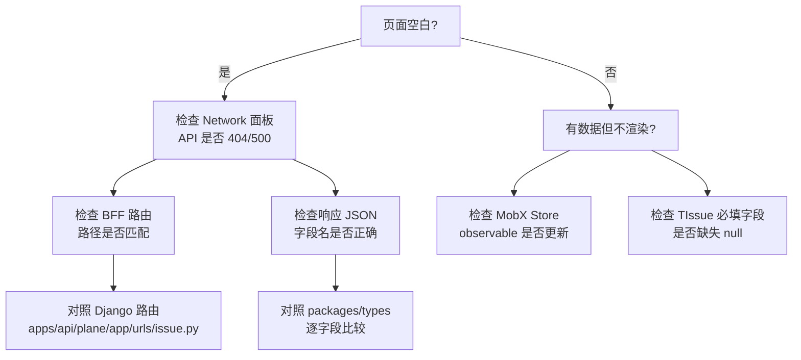

# 分阶段实施计划

> 只读展示层：Phase 0–3，无写操作、无生产部署。

---

## 1. 阶段总览

| 阶段        | 名称                   | 核心交付                   |
| ----------- | ---------------------- | -------------------------- |
| **Phase 0** | BFF 脚手架 + Bootstrap | 前端能进入主界面           |
| **Phase 1** | Linear 数据拉取与映射  | 内存缓存有真实 Linear 数据 |
| **Phase 2** | Issue 展示联调         | Kanban/List 正常渲染       |
| **Phase 3** | 过滤器与多布局         | 只读浏览完整可用           |

**不在范围内**：写回 Linear、Docker 生产部署、Webhook。

---

## 2. Phase 0：BFF 脚手架 + Bootstrap Mock

### 2.1 目标

前端 `apps/web` 能成功启动并进入工作区主界面，不报错。

### 2.2 任务清单

| #    | 任务                                     | 文件/位置                                                      | 优先级 |
| ---- | ---------------------------------------- | -------------------------------------------------------------- | ------ |
| 0.1  | 创建 `apps/bff/` 目录结构                | 见 [03-linear-integration.md](./03-linear-integration.md) §3.1 | P0     |
| 0.2  | 配置 `package.json`，加入 pnpm workspace | `apps/bff/package.json`                                        | P0     |
| 0.3  | 实现环境变量校验                         | `apps/bff/src/env.ts`                                          | P0     |
| 0.4  | 实现 HTTP Server（Hono）                 | `apps/bff/src/server.ts`                                       | P0     |
| 0.5  | Mock `/api/instances/`                   | `apps/bff/src/routes/instance.ts`                              | P0     |
| 0.6  | Mock `/auth/get-csrf-token/`             | `apps/bff/src/routes/auth.ts`                                  | P0     |
| 0.7  | Mock `/api/users/me/*`                   | `apps/bff/src/routes/user.ts`                                  | P0     |
| 0.8  | Mock `/api/users/me/workspaces/`         | `apps/bff/src/routes/workspace.ts`                             | P0     |
| 0.9  | 配置 CORS                                | `apps/bff/src/server.ts`                                       | P0     |
| 0.10 | 修改 `apps/web/.env` 指向 BFF            | `VITE_API_BASE_URL=http://localhost:8000`                      | P0     |
| 0.11 | 前端 Linear 模式 bypass 登录             | auth 路由/layout 条件分支 + `TODO(auth)`                       | P0     |

### 2.3 Mock 数据要求

#### `/api/instances/` 响应

```json
{
  "instance": {
    "id": "linear-bff-instance",
    "workspaces_exist": true
  },
  "config": {
    "enable_signup": false,
    "is_workspace_creation_disabled": true
  }
}
```

#### `/api/users/me/` 响应

```json
{
  "id": "mock-user-id",
  "email": "dev@linear.local",
  "display_name": "Linear Viewer",
  "first_name": "Linear",
  "last_name": "Viewer",
  "avatar": "",
  "is_onboarded": true,
  "is_tour_completed": true
}
```

#### `/api/users/me/workspaces/` 响应

```json
[
  {
    "id": "linear-workspace-id",
    "name": "Linear",
    "slug": "linear",
    "logo_url": null,
    "role": 20,
    "total_members": 1,
    "total_projects": 0
  }
]
```

### 2.4 验证清单

- [ ] `pnpm --filter=bff dev` 启动成功，监听 8000 端口
- [ ] `curl http://localhost:8000/api/instances/` 返回 200 JSON
- [ ] `curl http://localhost:8000/auth/get-csrf-token/` 返回 `{ csrf_token: "..." }`
- [ ] `curl http://localhost:8000/api/users/me/` 返回 Mock 用户
- [ ] `pnpm --filter=web dev` 启动成功
- [ ] 浏览器访问 `http://localhost:3000` 不白屏、不报 API 错误
- [ ] 浏览器 Network 面板确认 API 请求指向 `localhost:8000`
- [ ] 能进入 `/linear/` 工作区页面（可能无项目数据）

### 2.5 风险

| 风险                    | 概率 | 影响         | 缓解                                             |
| ----------------------- | ---- | ------------ | ------------------------------------------------ |
| 前端 bootstrap 请求遗漏 | 中   | 白屏         | 对照 `layout.preload.tsx` 和 layout 组件逐一确认 |
| CORS 错误               | 高   | API 调用失败 | 开发环境 `credentials: true` + 正确 origin       |
| 401 拦截器跳转          | 中   | 无限重定向   | Mock 端点始终返回 200                            |

---

## 3. Phase 1：Linear 数据拉取与映射

### 3.1 目标

BFF 能从 Linear API 拉取真实数据，完成 Linear → Plane 映射，内存缓存可用。

### 3.2 任务清单

| #    | 任务                       | 文件/位置                          | 优先级 |
| ---- | -------------------------- | ---------------------------------- | ------ |
| 1.1  | 实现 Linear GraphQL 客户端 | `apps/bff/src/linear/client.ts`    | P0     |
| 1.2  | 定义 GraphQL 查询          | `apps/bff/src/linear/queries.ts`   | P0     |
| 1.3  | 定义 Linear 原始类型       | `apps/bff/src/linear/types.ts`     | P0     |
| 1.4  | 实现内存缓存 Store         | `apps/bff/src/cache/store.ts`      | P0     |
| 1.5  | 实现定时 Worker            | `apps/bff/src/linear/worker.ts`    | P0     |
| 1.6  | 实现 Workspace Mapper      | `apps/bff/src/mapper/workspace.ts` | P0     |
| 1.7  | 实现 Project Mapper        | `apps/bff/src/mapper/project.ts`   | P0     |
| 1.8  | 实现 Issue Mapper          | `apps/bff/src/mapper/issue.ts`     | P0     |
| 1.9  | 实现 State Mapper          | `apps/bff/src/mapper/state.ts`     | P0     |
| 1.10 | 实现 Label Mapper          | `apps/bff/src/mapper/label.ts`     | P0     |
| 1.11 | 实现 User Mapper           | `apps/bff/src/mapper/user.ts`      | P1     |
| 1.12 | 实现 Project REST 端点     | `apps/bff/src/routes/project.ts`   | P0     |
| 1.13 | 实现 State REST 端点       | `apps/bff/src/routes/state.ts`     | P0     |
| 1.14 | 实现 Label REST 端点       | `apps/bff/src/routes/label.ts`     | P1     |
| 1.15 | 编写 Mapper 单元测试       | `apps/bff/tests/mapper.test.ts`    | P1     |

### 3.3 验证清单

- [ ] 配置 `LINEAR_API_KEY` 和 `LINEAR_WORKSPACE_ID` 后 BFF 启动无报错
- [ ] 启动日志显示 "Fetched N teams, M issues, K states"
- [ ] `GET /health` 返回缓存状态和数据统计
- [ ] `curl /api/workspaces/linear/projects/` 返回 Linear Team 映射的 Project 列表
- [ ] `curl /api/workspaces/linear/projects/{id}/states/` 返回 Workflow State 列表
- [ ] Project 的 `identifier` 与 Linear Team `key` 一致
- [ ] State 的 `group` 字段正确映射（backlog/started/completed 等）
- [ ] 缓存刷新后数据更新（修改 Linear 中 Issue 标题，等待下次 poll 后 BFF 数据变化）
- [ ] Mapper 单元测试全部通过

### 3.4 风险

| 风险                    | 概率 | 影响        | 缓解                             |
| ----------------------- | ---- | ----------- | -------------------------------- |
| Linear API Key 无效     | 低   | 无法拉取    | 启动时校验，失败则 exit 1        |
| GraphQL 查询超复杂度    | 中   | 拉取失败    | 拆分查询，分页拉取 issues        |
| Issue 数量过多（>1000） | 中   | 首次拉取慢  | cursor pagination + 进度日志     |
| 字段映射遗漏            | 高   | UI 显示异常 | 对照 `packages/types` 逐字段检查 |
| Linear SDK 版本兼容     | 低   | 类型错误    | 优先用原生 fetch + 自建类型      |

---

## 4. Phase 2：Issue 展示联调

### 4.1 目标

在 Plane Web UI 中能看到 Linear Issue 列表（至少 Kanban 和 List 布局）。

### 4.2 任务清单

| #   | 任务                            | 文件/位置                      | 优先级 |
| --- | ------------------------------- | ------------------------------ | ------ |
| 2.1 | 实现 Issue 列表 REST 端点       | `apps/bff/src/routes/issue.ts` | P0     |
| 2.2 | 实现 Issue 详情 REST 端点       | 同上                           | P0     |
| 2.3 | 实现 `issues-detail/` 端点      | 同上                           | P1     |
| 2.4 | 实现基础 query 参数过滤         | state, priority                | P0     |
| 2.5 | 确保 `TIssuesResponse` 格式正确 | 对照 `packages/types`          | P0     |
| 2.6 | 确保 `TIssue` 单条格式正确      | 含所有前端必填字段             | P0     |
| 2.7 | 处理 `description_html` 字段    | Markdown → HTML 转换           | P1     |
| 2.8 | 处理空数据场景                  | 无 Issue 时返回 `[]`           | P0     |

### 4.3 验证清单

- [ ] 浏览器访问 `/linear/projects/{projectId}/issues/` 页面加载成功
- [ ] Kanban 布局显示 Issue 卡片，按 State 分列
- [ ] List 布局显示 Issue 行，含标题、状态、优先级、指派人
- [ ] 点击 Issue 卡片进入详情页，显示标题和描述
- [ ] Issue 的 `sequence_id`（如 42）显示正确
- [ ] State 颜色在 Kanban 列头正确渲染
- [ ] Label 标签在 Issue 卡片上显示
- [ ] 无 Console 报错（MobX、类型、API 404）
- [ ] Network 面板确认 Issue API 返回 200，响应结构与 Django 一致

### 4.4 关键调试路径

若 UI 不显示数据，按以下顺序排查：



### 4.5 风险

| 风险                    | 概率 | 影响            | 缓解                                       |
| ----------------------- | ---- | --------------- | ------------------------------------------ |
| `TIssue` 缺少必填字段   | 高   | 组件 crash      | 从 Django 响应抓样本对比                   |
| `group_by` 参数未实现   | 中   | Kanban 不分列   | 返回带 `state_id` 的扁平列表，前端自行分组 |
| `description_html` 格式 | 中   | 详情页空白      | 使用 marked 或类似库转 HTML                |
| Issue 列表分页          | 低   | 大量 Issue 卡顿 | MVP 全量返回，后续加 cursor                |

---

## 5. Phase 3：过滤器与多布局

### 5.1 目标

Issue 过滤器（状态、优先级、标签、指派人）可用；Calendar、Gantt、Spreadsheet 布局基本可用。

### 5.2 任务清单

| #   | 任务                        | 文件/位置                          | 优先级 |
| --- | --------------------------- | ---------------------------------- | ------ |
| 3.1 | 实现 labels 过滤            | `apps/bff/src/routes/issue.ts`     | P0     |
| 3.2 | 实现 assignees 过滤         | 同上                               | P0     |
| 3.3 | 实现 order_by 排序          | 同上                               | P1     |
| 3.4 | 实现 Workspace Labels 端点  | `apps/bff/src/routes/label.ts`     | P0     |
| 3.5 | 实现 Workspace Members 端点 | `apps/bff/src/routes/workspace.ts` | P1     |
| 3.6 | 确保 Calendar 布局数据      | `target_date` 字段                 | P1     |
| 3.7 | 确保 Gantt 布局数据         | `start_date` / date 字段           | P2     |
| 3.8 | 隐藏不支持的功能入口        | 前端条件渲染                       | P2     |

### 5.3 验证清单

- [ ] 状态过滤器：选择特定 State，列表只显示该状态的 Issue
- [ ] 优先级过滤器：选择 High，只显示高优先级 Issue
- [ ] 标签过滤器：选择 Label，只显示带该标签的 Issue
- [ ] 指派人过滤器：选择 User，只显示指派给该用户的 Issue
- [ ] Calendar 布局：有 `target_date` 的 Issue 显示在日历上
- [ ] Gantt 布局：基本渲染（可接受功能受限）
- [ ] Spreadsheet 布局：表格列正确显示
- [ ] 侧边栏项目列表正确显示所有 Linear Team
- [ ] 切换项目后 Issue 列表正确刷新

### 5.4 UI 功能隐藏建议

以下 Plane 功能在 Linear 模式下无对应数据，建议隐藏：

| UI 入口             | 原因                | 隐藏方式           |
| ------------------- | ------------------- | ------------------ |
| Cycle 菜单          | Linear Cycle 未映射 | 路由守卫或导航配置 |
| Module 菜单         | 无对应              | 同上               |
| Pages/Wiki          | 无对应              | 同上               |
| Analytics           | 无对应              | 同上               |
| 创建工作区          | 单 workspace 模式   | 隐藏按钮           |
| 项目设置 → 状态管理 | 只读                | 禁用编辑按钮       |
| Issue 创建按钮      | Phase 4 前只读      | 隐藏或 disabled    |

### 5.5 风险

| 风险                  | 概率 | 影响       | 缓解                               |
| --------------------- | ---- | ---------- | ---------------------------------- |
| Calendar 无 date 数据 | 中   | 日历空白   | 确保 `target_date` 映射            |
| Gantt 依赖复杂字段    | 高   | 布局不可用 | MVP 可跳过 Gantt                   |
| 过滤器参数名不匹配    | 中   | 过滤无效   | 对照 `IssueService` query 构建逻辑 |

---

## 6. 跨阶段风险汇总

| #   | 风险                               | 阶段   | 严重性 | 缓解策略                           |
| --- | ---------------------------------- | ------ | ------ | ---------------------------------- |
| R1  | Plane 类型与 Django 响应不完全一致 | 1-2    | 高     | 用 Django 实例抓响应样本作 fixture |
| R2  | 前端 bootstrap 端点遗漏            | 0      | 高     | 对照所有 Service 的启动调用        |
| R3  | Linear API 速率限制                | 1      | 中     | poll interval ≥ 60s，分页拉取      |
| R4  | MobX Store 状态残留                | 2      | 中     | 切换项目时 Store 正确 reset        |
| R5  | 不支持的功能导致 UI 报错           | 3      | 中     | 隐藏无数据的功能入口               |
| R7  | 上游 Plane 版本升级                | 全阶段 | 低     | BFF 独立，前端仅改 env             |
| R8  | Linear API 结构变更                | 全阶段 | 低     | Mapper 层隔离，类型独立定义        |

---

## 7. 验收标准

- [ ] 仅启动 BFF + Web，无需 Django/Postgres
- [ ] 浏览器展示 Linear Issue 看板（只读）
- [ ] 支持 Kanban、List 布局
- [ ] Issue 详情可查看标题、描述、状态、标签
- [ ] 数据定时从 Linear 刷新到内存（默认 60s）

```bash
# 1. 克隆仓库
git clone <repo> && cd plane

# 2. 安装依赖
pnpm install

# 3. 配置 BFF
cp apps/bff/.env.example apps/bff/.env
# 编辑 .env，填入 LINEAR_API_KEY 和 LINEAR_WORKSPACE_ID

# 4. 配置 Web
echo 'VITE_API_BASE_URL=http://localhost:8000' > apps/web/.env

# 5. 启动（两个终端）
pnpm --filter=bff dev    # 终端 1
pnpm --filter=web dev    # 终端 2

# 6. 验证
open http://localhost:3000
# 应看到 Linear 工作区的 Issue 看板
```
