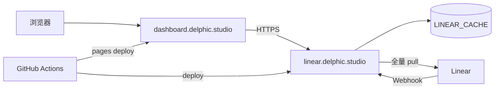

# Cloudflare 生产部署总览

> 将 Linear 只读展示层部署到 Cloudflare：Pages 前端 + Worker BFF + KV 缓存，Webhook 驱动同步，GitHub Actions 自动部署。

---

## 1. 域名与产品

| 组件           | 域名                       | Cloudflare 产品   | 源码            |
| -------------- | -------------------------- | ----------------- | --------------- |
| 前端 Dashboard | `dashboard.delphic.studio` | Pages             | `apps/web`      |
| Linear BFF API | `linear.delphic.studio`    | Worker（Hono）    | `apps/bff`      |
| 缓存           | —                          | KV `LINEAR_CACHE` | 绑定 BFF Worker |

---

## 2. 与本地架构的差异

| 维度       | 本地 Node BFF       | Cloudflare                      |
| ---------- | ------------------- | ------------------------------- |
| 缓存       | 进程内 `Map`        | KV 持久化                       |
| 同步触发   | `setInterval` 轮询  | Webhook + cache miss 回源       |
| Cache miss | `503 Retry-After`   | 请求内 await pull → 读 KV → 200 |
| 运行环境   | `@hono/node-server` | Worker `fetch` + `waitUntil`    |
| 部署       | `pnpm dev`          | GitHub Actions → Wrangler       |

---

## 3. 同步策略

1. Linear 变更 → `POST https://linear.delphic.studio/webhooks/linear`
2. Worker **5s 内 200**，`ctx.waitUntil()` 执行 debounce（**30s**）后全量 pull
3. 结果写入 KV
4. 读 API 时 cache miss → **请求内 await** 全量 pull，完成后读 KV 返回 200

无 Cron。无前端轮询。

详见 [03-linear-webhooks.md](./03-linear-webhooks.md)、[09-final-decisions.md](./09-final-decisions.md)。

---

## 4. 文档索引

| 文档                                                               | 内容                    |
| ------------------------------------------------------------------ | ----------------------- |
| **[09-final-decisions.md](./09-final-decisions.md)**               | **最终决策（权威）**    |
| [SETUP.md](./SETUP.md)                                             | 用户操作清单            |
| [01-architecture.md](./01-architecture.md)                         | 架构、KV 模型、CORS     |
| [02-worker-kv-bff.md](./02-worker-kv-bff.md)                       | BFF → Worker 改造       |
| [03-linear-webhooks.md](./03-linear-webhooks.md)                   | Webhook、验签、debounce |
| [04-github-cicd.md](./04-github-cicd.md)                           | GitHub Actions、密钥    |
| [05-pages-frontend.md](./05-pages-frontend.md)                     | Pages 构建与域名        |
| [06-implementation-phases.md](./06-implementation-phases.md)       | 分阶段任务              |
| [07-confirmation-checklist.md](./07-confirmation-checklist.md)     | 已确认项归档            |
| [08-post-confirmation-review.md](./08-post-confirmation-review.md) | 审查结论与验收          |

---

## 5. 实施顺序

1. **CF-0** ✅ — GitHub Secrets、KV、Linear webhook（[SETUP.md](./SETUP.md)）
2. **CF-1** 🔄 — Worker + KV + Webhook + cache miss（[02-worker-kv-bff.md](./02-worker-kv-bff.md)）
3. **CF-3** — Pages + `dashboard.delphic.studio`（[05-pages-frontend.md](./05-pages-frontend.md)）
4. **CF-4** — CI 自动部署（[04-github-cicd.md](./04-github-cicd.md)）

任务分解见 [06-implementation-phases.md](./06-implementation-phases.md)。

---

## 6. 相关文档

- [../00-overview.md](../00-overview.md) — Linear 集成总览
- [../03-linear-integration.md](../03-linear-integration.md) — BFF 与 Linear GraphQL
