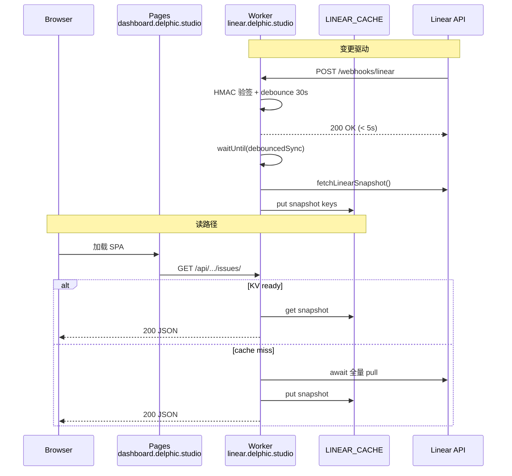

# Cloudflare 部署架构

---

## 1. 逻辑架构



---

## 2. 为何 Worker + Pages 分离（非 Pages Functions）

| 需求                               | 独立 Worker | Pages Functions       |
| ---------------------------------- | ----------- | --------------------- |
| `linear.delphic.studio` 自定义域名 | ✅ 原生     | 通常挂在 Pages 域名下 |
| Webhook `waitUntil` 长任务         | ✅          | 受限                  |
| KV 绑定                            | 一等公民    | 可行但耦合前端发布    |
| 前后端独立回滚                     | ✅          | 耦合同一 Pages 项目   |

**结论**：`apps/web` → Pages；`apps/bff` → **独立 Worker**。

---

## 3. KV 数据模型

当前 BFF 内存结构（`cache/store.ts`）在 Worker 上需序列化为 KV：

```
LINEAR_CACHE/
  meta              → { ready, lastFetchedAt, stats, version, error? }
  workspace         → IWorkspace JSON
  projects          → TPartialProject[]
  users             → IUserLite[]
  issues            → TIssue[]（issue <1k，单 blob）
  states:{projectId}→ IState[]
  labels:{projectId} → IIssueLabel[]
  comments:{issueId} → TIssueComment[]
  user-properties:{projectId} → display filters（PATCH 持久化）

  sync:lock         → "1"（TTL 300s，单飞锁）
  sync:scheduled_at → debounce 时间戳
  webhook:delivery:{uuid} → "1"（TTL 24h，幂等）
```

### 读取组装

1. `get meta` → 若 `!ready` 且配置了 API Key → **请求内 await sync**
2. 并行 `get` 各分片
3. 在内存中组装为现有 `PlaneCache` 形状，供 mapper/routes 复用

---

## 4. 同步触发源

| 触发                    | 行为                                                                      |
| ----------------------- | ------------------------------------------------------------------------- |
| `POST /webhooks/linear` | 验签 → **5s 内 200** → `ctx.waitUntil(debouncedSync)` → 全量 pull → 写 KV |
| Cache miss（读 API）    | **请求内 await** 全量 pull → 写 KV → 返回 **200**                         |

**不包含**：Cron / `scheduled()`、前端轮询、`setInterval`（本地 Node 开发可保留）。

---

## 5. 网络与 CORS

| 设置          | 值                                                     |
| ------------- | ------------------------------------------------------ |
| `CORS_ORIGIN` | `https://dashboard.delphic.studio`（精确匹配，含协议） |
| Credentials   | BFF 已 `credentials: true`；origin 必须白名单          |

前端构建：

```bash
VITE_API_BASE_URL=https://linear.delphic.studio
VITE_WEB_BASE_URL=https://dashboard.delphic.studio
```

---

## 6. Worker 运行时约束

| 约束             | 影响                              | 缓解                                     |
| ---------------- | --------------------------------- | ---------------------------------------- |
| 无持久进程       | 不能 `setInterval`                | Webhook + cache-miss 回源                |
| CPU 时间（Free） | cache miss 同步 pull 可能接近上限 | 冷启动失败时 503 + `Retry-After`（兜底） |
| 隔离实例         | 内存不共享                        | 全部走 KV                                |
| `nodejs_compat`  | `marked` / `zod` 可能需要         | `wrangler.toml` `compatibility_flags`    |

---

## 7. 建议仓库布局

```
plane/
├── apps/
│   ├── bff/
│   │   ├── src/
│   │   │   ├── server.ts
│   │   │   ├── worker-entry.ts       # export default { fetch }
│   │   │   ├── cache/kv-store.ts
│   │   │   ├── sync/{run-sync,debounce}.ts
│   │   │   └── webhooks/linear.ts    # POST /webhooks/linear
│   │   └── wrangler.toml
│   └── web/
│       └── public/_redirects
├── .github/workflows/
│   ├── deploy-linear-bff.yml         # secret put + deploy
│   └── deploy-dashboard.yml
└── docs/plans/cloudflare-deploy/
```

---

## 8. 环境对照表

| 变量                       | Worker Secret | Worker Var | GitHub Secret      | GitHub Variable | 前端 VITE                    |
| -------------------------- | ------------- | ---------- | ------------------ | --------------- | ---------------------------- |
| `LINEAR_API_KEY`           | ✅            | —          | ✅（CI 注入）      | —               | ❌ 永不                      |
| `LINEAR_WEBHOOK_SECRET`    | ✅            | —          | ✅                 | —               | ❌                           |
| `LINEAR_WORKSPACE_ID`      | 可选          | —          | 已配置，运行时可选 | —               | ❌                           |
| `CORS_ORIGIN`              | —             | ✅         | —                  | ✅              | —                            |
| `PLANE_WORKSPACE_SLUG`     | —             | ✅         | —                  | ✅              | `VITE_LINEAR_WORKSPACE_SLUG` |
| `PLANE_WORKSPACE_NAME`     | —             | ✅         | —                  | ✅              | —                            |
| `SYNC_DEBOUNCE_MS`         | —             | ✅ `30000` | —                  | ✅              | —                            |
| `CLOUDFLARE_API_TOKEN`     | —             | —          | ✅                 | —               | —                            |
| `CLOUDFLARE_ACCOUNT_ID`    | —             | —          | ✅                 | —               | —                            |
| `VITE_API_BASE_URL`        | —             | —          | —                  | ✅              | ✅ 构建时                    |
| `VITE_LINEAR_DISPLAY_MODE` | —             | —          | —                  | ✅              | ✅                           |

密钥由 CI workflow `wrangler secret put` 从 GitHub Secrets 注入；**不**手动执行。
