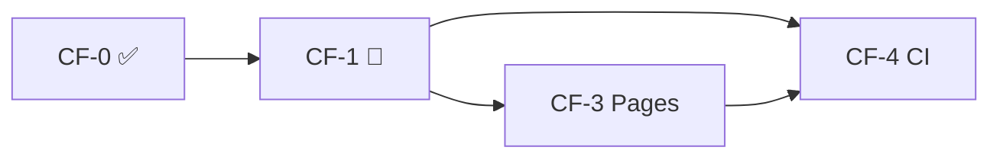

# Cloudflare 部署分阶段实施

> 决策见 [09-final-decisions.md](./09-final-decisions.md)。

---

## 阶段总览

| 阶段     | 名称                  | 状态   | 交付物                                      |
| -------- | --------------------- | ------ | ------------------------------------------- |
| **CF-0** | 基础设施与密钥        | ✅     | KV、GitHub Secrets、Linear webhook          |
| **CF-1** | Worker + KV + Webhook | 🔄     | `linear.delphic.studio` 可读 API + 事件同步 |
| **CF-3** | Pages 前端            | 待开始 | `dashboard.delphic.studio`                  |
| **CF-4** | GitHub CI/CD          | 草案   | push 自动部署                               |
| **CF-5** | 硬化（可选）          | —      | 监控、分片、私有 team                       |

CF-2（独立 Webhook 阶段）已并入 CF-1。

---

## CF-0：基础设施与密钥 ✅

| #   | 任务                                         | 负责 |
| --- | -------------------------------------------- | ---- |
| 0.1 | `delphic.studio` 在 Cloudflare               | 用户 |
| 0.2 | KV `LINEAR_CACHE`（ID 已写入 wrangler.toml） | 开发 |
| 0.3 | GitHub Secrets / Variables                   | 用户 |
| 0.4 | Linear webhook 注册                          | 用户 |
| 0.5 | `wrangler.toml`、`.dev.vars.example`         | 开发 |

---

## CF-1：Worker + KV + Webhook 🔄

**目标**：`GET /health` 返回 `cache.ready: true`；Webhook 驱动 sync；cache miss 请求内回源。

| #    | 任务                                          | 文件                                     |
| ---- | --------------------------------------------- | ---------------------------------------- |
| 1.1  | `CacheBackend` + `MemoryCacheBackend`         | `cache/backend.ts`, `cache/store.ts`     |
| 1.2  | `KvCacheBackend`                              | `cache/kv-store.ts`                      |
| 1.3  | `loadEnvFromBindings`                         | `env.ts`                                 |
| 1.4  | `worker-entry.ts` + `runSync`                 | `worker-entry.ts`, `sync/run-sync.ts`    |
| 1.5  | `createServer(env, cache)` 依赖注入           | `server.ts`, `routes/helpers.ts`         |
| 1.6  | `POST /webhooks/linear` + HMAC + debounce 30s | `webhooks/linear.ts`, `sync/debounce.ts` |
| 1.7  | Cache miss：请求内 await pull → 读 KV         | `routes/helpers.ts`                      |
| 1.8  | 删除前端 poll hook / env                      | `apps/web`                               |
| 1.9  | Vitest + webhook 单测                         | `tests/`                                 |
| 1.10 | 绑定 `linear.delphic.studio`                  | Dashboard                                |

**验收**：

- `/api/instances/`、`/api/workspaces/:slug/projects/` 有数据
- Linear 改 issue → debounce → KV `lastFetchedAt` 更新
- Cache miss 冷启动可 pull 或 503 兜底
- 无 Cron、无 `scheduled()`

---

## CF-3：Pages 前端

| #   | 任务                            | 文件                         |
| --- | ------------------------------- | ---------------------------- |
| 3.1 | `_redirects` SPA fallback       | `apps/web/public/_redirects` |
| 3.2 | 生产 `VITE_*` 在 CI 注入        | workflow                     |
| 3.3 | 绑定 `dashboard.delphic.studio` | Dashboard                    |
| 3.4 | 端到端验收                      | 手动                         |

详见 [05-pages-frontend.md](./05-pages-frontend.md)。

---

## CF-4：GitHub CI/CD

| #   | 任务                                           | 文件                 |
| --- | ---------------------------------------------- | -------------------- |
| 4.1 | `deploy-linear-bff.yml`（secret put + deploy） | `.github/workflows/` |
| 4.2 | `deploy-dashboard.yml`                         | `.github/workflows/` |
| 4.3 | PR 跑 `bff test`（无 deploy）                  | 可选                 |

详见 [04-github-cicd.md](./04-github-cicd.md)。

---

## CF-5：硬化（可选）

| #   | 任务                        |
| --- | --------------------------- |
| 5.1 | Analytics / Logpush         |
| 5.2 | `POST /admin/sync` + Access |
| 5.3 | 私有 Team 额外 webhook      |
| 5.4 | KV 分片（>5k issues）       |

---

## 依赖关系

---

## 不在本阶段范围

- 写回 Linear
- Django / Postgres 部署
- 真实用户认证
- Cron 兜底同步
- 前端 BFF 轮询
